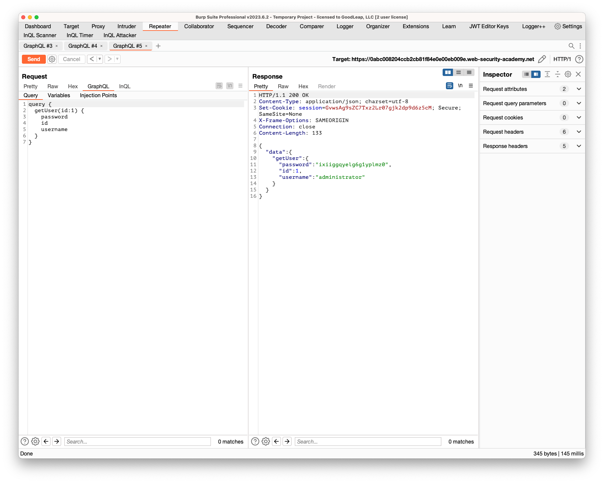

## Accidental exposure of private GraphQL fields

### Objective:

- The user management functions for this lab are powered by a GraphQL endpoint. 
- The lab contains an access control vulnerability whereby you can induce the API to reveal user credential fields.
- To solve the lab, sign in as the administrator and delete the username carlos.

### Security Weakness:

### Exploitation Methodology:

1. In Burp's browser, access the lab and select **My account**.
2. Attempt to log in to the site.    
3. In Burp, go to **Proxy > HTTP history** and notice that the login attempt is sent as a GraphQL mutation containing a username and password.
4. Right-click the login request and select **Send to Repeater**.
5. Use InQL to scan the GraphQL endpoint. Notice the following:
    - There is a **`getUser`** query that returns a user's username and password.
    - This query fetches the relevant user information via a direct reference to an `id` number.
6. Copy the contents of the **`getUser`** query.
7. Go to the **Repeater** tab and select the **InQL** subtab.
8. Paste the contents of the **`getUser`** query into the **`Query`** box, replacing the original GraphQL login mutation.
9. Select the **Pretty** tab and remove the **`operationName`** property.
10. Click **Send**. Notice that the default **`1334`** user ID causes the API to return an error. 
11. Test alternative user IDs until the API returns the administrator's credentials. In this case, the administrator's ID is **`1`**.

12. Log in to the site as the administrator, go to the **Admin** panel, and delete **`carlos`** to solve the lab.

### Insecure Code:

### Secure Code:
