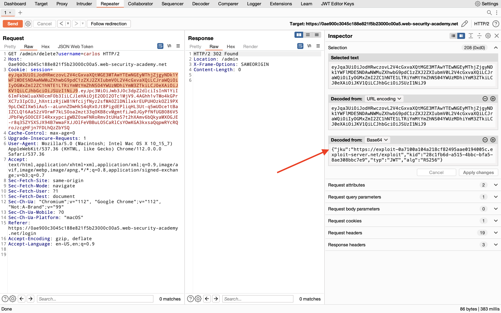

## JWT authentication bypass via jku header injection

### Objective:
To solve the lab, modify your session token to gain access to the admin panel at `/admin`, then delete the user `carlos`.

### Security Weakness:
1. Making use of user controlled **jku** value to verify the signature 

### Exploitation Methodology:
##### Part 1 - Upload a malicious JWK Set
1.  In Burp, load the JWT Editor extension from the BApp store.
2.  In the lab, log in to your own account and send the post-login `GET /my-account` request to Burp Repeater.
3.  In Burp Repeater, change the path to `/admin` and send the request. Observe that the admin panel is only accessible when logged in as the `administrator` user.
4.  Go to the **JWT Editor Keys** tab in Burp's main tab bar.
5.  Click **New RSA Key**.
6.  In the dialog, click **Generate** to automatically generate a new key pair, then click **OK** to save the key. Note that you don't need to select a key size as this will automatically be updated later.
7.  In the browser, go to the exploit server.
8.  Replace the contents of the **Body** section with an empty JWK Set as follows:
    `{ "keys": [ ] }`
9.  Back on the **JWT Editor Keys** tab, right-click on the entry for the key that you just generated, then select **Copy Public Key as JWK**.
10.  Paste the JWK into the `keys` array on the exploit server, then store the exploit. The result should look something like this:
```json
{ "keys": [ { "kty": "RSA", "e": "AQAB", "kid": "28c1fb6d-a515-4bbc-bfa5-8ae308bbc7e9", "n": "4UPHllK52oFIPIgNSCq2Jeza95ldupEaoFr8VYZZaewjG0WuYg2wExrXviYZZv-CX4xq9Fk2exc0loVxoYxG_mX3RUPbS2OfZYIGgN4kx5nchf2o-7akjJ8Z6AbmTD3Q3EK_lKMkuWE2dxqXg3mzyXt9Bz3g1K500a2PwRF9Jxm1rkqjBUy_c0u7x7GU_VUrihbunbdLZ5hTl2FQ_7Lc7qJE9MQHArXFNchEq8qHEN63vvzz3ib-Y_Wp8btPnNHlOcmmsAnXemMj_-yNfiJ3tCVPnesnzrXc9wP-AZF-HxlpxLCqTDub_fWUGo2t9bpSHgH0bL11ZwplLtsz3n55QQ" } ] }
```
##### Part 2 - Modify and sign the JWT
1.  Go back to the `GET /admin` request in Burp Repeater and switch to the extension-generated **JSON Web Token** message editor tab.
2.  In the header of the JWT, replace the current value of the `kid` parameter with the `kid` of the JWK that you uploaded to the exploit server.
3.  Add a new `jku` parameter to the header of the JWT. Set its value to the URL of your JWK Set on the exploit server.
4.  In the payload, change the value of the `sub` claim to `administrator`.
5.  At the bottom of the tab, click **Sign**, then select the RSA key that you generated in the previous section.
6.  Make sure that the **Don't modify header** option is selected, then click **OK**. The modified token is now signed with the correct signature.

7.  Send the request. Observe that you have successfully accessed the admin panel.
8.  In the response, find the URL for deleting Carlos (`/admin/delete?username=carlos`). Send the request to this endpoint to solve the lab.

### Insecure Code:
This function is vulnerable to a JWT authentication bypass via jku header injection. An attacker could craft a JWT token with a malicious jku value that points to a public key they control, allowing them to bypass the server's signature verification.
```javascript
const jwt = require('jsonwebtoken');
const axios = require('axios');

async function verifyJWT(jwtPayload) {
  const header = jwt.decode(jwtPayload, { complete: true }).header;
  const jku = header.jku;
  const key = await axios.get(jku);
  return jwt.verify(jwtPayload, key.data);
}
```

### Secure Code:
This function uses the `jwks-rsa` library to securely fetch the public keys needed to verify the signature, rather than relying on a user-controlled `jku` value. It also specifies the algorithm to use for verification, adding an extra layer of security.
```javascript
const jwt = require('jsonwebtoken');
const jwksClient = require('jwks-rsa');

const client = jwksClient({
  jwksUri: 'https://example.com/.well-known/jwks.json'
});

async function verifyJWT(jwtPayload) {
  const header = jwt.decode(jwtPayload, { complete: true }).header;
  const kid = header.kid;
  const getSigningKey = (header, callback) => {
    client.getSigningKey(header.kid, (err, key) => {
      if (err) {
        callback(err);
        return;
      }
      const signingKey = key.publicKey || key.rsaPublicKey;
      callback(null, signingKey);
    });
  };
  return jwt.verify(jwtPayload, getSigningKey, { algorithms: ['RS256'] });
}
```
