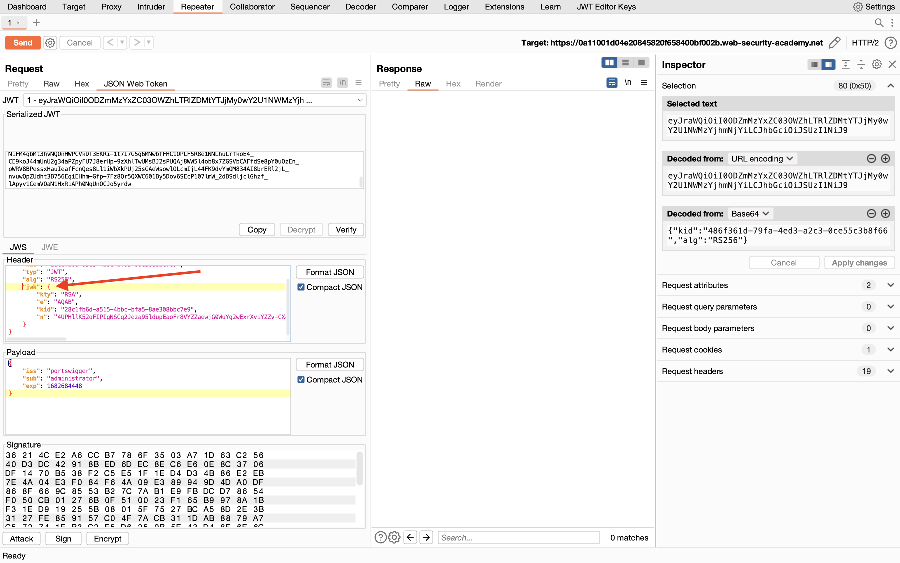

## JWT authentication bypass via jwk header injection

### Objective:
To solve the lab, modify and sign a JWT that gives you access to the admin panel at `/admin`, then delete the user `carlos`.

### Security Weakness:
1. Ideally, servers should only use a limited whitelist of public keys to verify JWT signatures. However, misconfigured servers sometimes use any key that's embedded in the **jwk** parameter.

### Exploitation Methodology:
1.  In Burp, load the JWT Editor extension from the BApp store.
2.  In the lab, log in to your own account and send the post-login `GET /my-account` request to Burp Repeater.
3.  In Burp Repeater, change the path to `/admin` and send the request. Observe that the admin panel is only accessible when logged in as the `administrator` user.
4.  Go to the **JWT Editor Keys** tab in Burp's main tab bar.
5.  Click **New RSA Key**.
6.  In the dialog, click **Generate** to automatically generate a new key pair, then click **OK** to save the key. Note that you don't need to select a key size as this will automatically be updated later.
7.  Go back to the `GET /admin` request in Burp Repeater and switch to the extension-generated `JSON Web Token` tab.
8.  In the payload, change the value of the `sub` claim to `administrator`.
9.  At the bottom of the **JSON Web Token** tab, click **Attack**, then select **Embedded JWK**. When prompted, select your newly generated RSA key and click **OK**.
10.  In the header of the JWT, observe that a `jwk` parameter has been added containing your public key.

11.  Send the request. Observe that you have successfully accessed the admin panel.
12.  In the response, find the URL for deleting Carlos (`/admin/delete?username=carlos`). Send the request to this endpoint to solve the lab.

### Insecure Code:

```javascript
const jwt = require('jsonwebtoken');

function verifyJWT(token) {
  try {
    jwt.verify(token, null, { algorithms: ['RS256'], jwk: true });
    return true;
  } catch (err) {
    return false;
  }
}
```


### Secure Code:
```javascript
const jwt = require('jsonwebtoken');
const jwksClient = require('jwks-rsa');

const jwksUri = 'https://example.com/.well-known/jwks.json';

const client = jwksClient({
  jwksUri: jwksUri
});

async function verifyJWT(token) {
  try {
    const decoded = jwt.decode(token, { complete: true });
    const kid = decoded.header.kid;

    const key = await client.getSigningKey(kid);
    const signingKey = key.publicKey || key.rsaPublicKey;

    jwt.verify(token, signingKey, { algorithms: ['RS256'] });
    return true;
  } catch (err) {
    return false;
  }
}
```