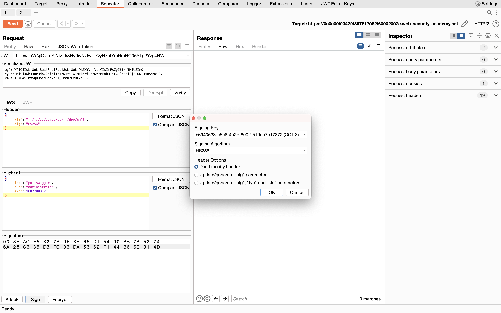

## JWT authentication bypass via kid header path traversal

### Objective:
To solve the lab, forge a JWT that gives you access to the admin panel at `/admin`, then delete the user `carlos`.

### Security Weakness:
1. Path traversal in *kid* parameter.
2. re-signing the key by pointing the *kid* value to a known file on the server.

### Exploitation Methodology:
##### Generate a suitable signing key
1.  In Burp, load the JWT Editor extension from the BApp store.
2.  In the lab, log in to your own account and send the post-login `GET /my-account` request to Burp Repeater.
3.  In Burp Repeater, change the path to `/admin` and send the request. Observe that the admin panel is only accessible when logged in as the `administrator` user.
4.  Go to the **JWT Editor Keys** tab in Burp's main tab bar.
5.  Click **New Symmetric Key**.
6.  In the dialog, click **Generate** to generate a new key in JWK format. Note that you don't need to select a key size as this will automatically be updated later.
7.  Replace the generated value for the `k` property with a Base64-encoded null byte `AA==`. Note that this is just a workaround because the JWT Editor extension won't allow you to sign tokens using an empty string.
8.  Click **OK** to save the key.

##### Modify and sign the JWT
1.  Go back to the `GET /admin` request in Burp Repeater and switch to the extension-generated **JSON Web Token** message editor tab.
2.  In the header of the JWT, change the value of the `kid` parameter to a **path traversal** sequence pointing to the `/dev/null` file: `../../../../../../../dev/null`
> **Note: In this solution, we'll point the `kid` parameter to the standard file `/dev/null`. In practice, you can point the `kid` parameter to any file with predictable contents.
> If the server stores its verification keys in a database, the `kid` header parameter is also a potential vector for SQL Injection attacks.**
1.  In the JWT payload, change the value of the `sub` claim to `administrator`.
2.  At the bottom of the tab, click **Sign**, then select the symmetric key that you generated in the previous section.
3.  Make sure that the **Don't modify header** option is selected, then click **OK**. The modified token is now signed using a null byte as the secret key.

6.  Send the request and observe that you have successfully accessed the admin panel.
7.  In the response, find the URL for deleting Carlos (`/admin/delete?username=carlos`). Send the request to this endpoint to solve the lab.

### Insecure Code:

```javascript
const jwt = require('jsonwebtoken');
const fs = require('fs');

function verifyJWT(token) {
  const decoded = jwt.decode(token, { complete: true });
  const header = decoded.header;
  const kid = header.kid;

  const cert = fs.readFileSync('/path/to/keys/' + kid + '.pub');
  jwt.verify(token, cert, { algorithms: ['RS256'] });
  return true;
}
```

### Secure Code:

```javascript
const jwt = require('jsonwebtoken');
const jwksClient = require('jwks-rsa');
const { v4: uuidv4 } = require('uuid');
const { isUUID } = require('validator');

function verifyJWT(token) {
  const decoded = jwt.decode(token, { complete: true });
  const header = decoded.header;
  const kid = header.kid;

  // Verify kid parameter to prevent path traversal attacks
  if (!isUUID(kid, 4)) {
    throw new Error('Invalid kid parameter');
  }

  const client = jwksClient({
    jwksUri: 'https://example.com/.well-known/jwks.json'
  });

  function getKey(header, callback) {
    client.getSigningKey(header.kid, function(err, key) {
      const signingKey = key.publicKey || key.rsaPublicKey;
      callback(null, signingKey);
    });
  }

  jwt.verify(token, getKey, { algorithms: ['RS256'] });
  return true;
}
```