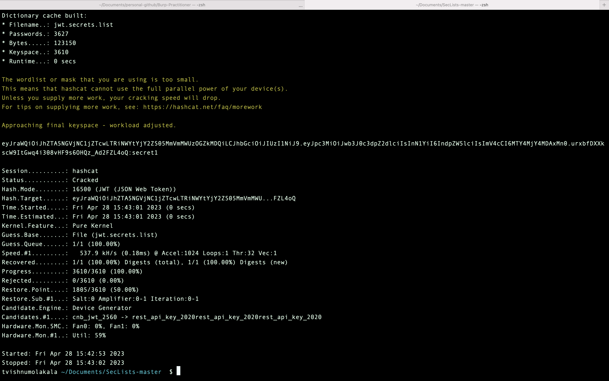

### Objective:
To solve the lab, first brute-force the website's secret key. Once you've obtained this, use it to sign a modified session token that gives you access to the admin panel at `/admin`, then delete the user `carlos`.

### Security Weakness:
1. Secret key used for signing can be easily guessed or brute forced.

### Exploitation Methodology:
1. 1. Turn on burp to proxy all requests and login to the portal. 
2. Under *Proxy --> Http history* take a look at the requests and send the */my-account* request to repeater.
3. Grab the jwt token from *Cookie: session=* and copy the content to a file. Name the *jwt.txt*
4. Open terminal and install hashcat. Download a copy of well-known and most commonly used jwt secrets list from a known source. [jwt.secrets.list](https://raw.githubusercontent.com/wallarm/jwt-secrets/master/jwt.secrets.list)
5. Run the following hashcat command from the terminal
```bash
hashcat -a 0 -m 16500 jwt.txt jwt.secrets.list
```

6. Base64 encode the brute forced secret. 
7. In burp under *Extensions --> BApp Store* install *JWT Editor*
8. Open *JWT Editor Keys* and select *New Symmetric Key*. 
> **Note that you don't need to select a key size as this will automatically be updated later.**
1. Replace the value of "k" with base64 encoded secret.
2. Go back to Repeater and select *JSON Web Token* tab. 
3. In the payload, change the value of the `sub` claim to `administrator`
4. At the bottom of the tab, click `Sign`, then select the key that you generated in the previous section.
5. Make sure that the `Don't modify header` option is selected, then click `OK`. The modified token is now signed with the correct signature.
6. Send the request and observe that you have successfully accessed the admin panel.
7. In the response, find the URL for deleting Carlos (`/admin/delete?username=carlos`). Send the request to this endpoint to solve the lab.

### Insecure Code:
In the vulnerable code example, the `signJWT()` function takes a payload as input and signs it using a hardcoded secret key `secret1`. This is vulnerable to JWT authentication bypass via weak signing key, as an attacker can easily guess or brute-force the secret key to generate valid JWT tokens.
```javascript
const jwt = require('jsonwebtoken');

function signJWT(payload) {
  const token = jwt.sign(payload, 'secret1');
  return token;
}
```

### Secure Code:
In this code example, we first generate a random secret using the `crypto` module. We then use this secret to sign the JWT, as shown in the `signJWT` function. This ensures that the same strong secret is used every time for JWT signing and verification.
```javascript
const jwt = require('jsonwebtoken');
const crypto = require('crypto');

// Generate a random secret using a strong algorithm
const secret = crypto.randomBytes(64).toString('hex');

// Sign the payload using the strong secret
function signJWT(payload) {
  return jwt.sign(payload, secret);
}
```
