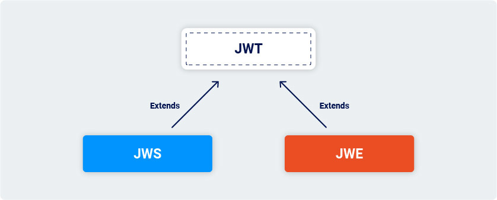

## Labs

| #    | Lab Name                                                                                                                                                            | Level        |
| ---- | ------------------------------------------------------------------------------------------------------------------------------------------------------------------- | ------------ |
| 1 ✅ | [JWT authentication bypass via unverified signature](JWT%20authentication%20bypass%20via%20unverified%20signature)                                               | APPRENTICE   |
| 2 ✅ | [JWT authentication bypass via flawed signature verification](JWT%20authentication%20bypass%20via%20flawed%20signature%20verification)                           | APPRENTICE   |
| 3 ✅ | [JWT authentication bypass via weak signing key](JWT%20authentication%20bypass%20via%20weak%20signing%20key)                                                     | PRACTITIONER |
| 4 ✅ | [JWT authentication bypass via jwk header injection](JWT%20authentication%20bypass%20via%20jwk%20header%20injection)                                             | PRACTITIONER |
| 5 ✅ | [JWT authentication bypass via jku header injection](JWT%20authentication%20bypass%20via%20jku%20header%20injection)                                             | PRACTITIONER |
| 6 ✅ | [JWT authentication bypass via kid header path traversal](JWT%20authentication%20bypass%20via%20kid%20header%20path%20traversal)                                 | PRACTITIONER |
| 7 ✅ | [JWT authentication bypass via algorithm confusion](JWT%20authentication%20bypass%20via%20algorithm%20confusion)                                                 | EXPERT       |
| 8    | [JWT authentication bypass via algorithm confusion with no exposed key](JWT%20authentication%20bypass%20via%20algorithm%20confusion%20with%20no%20exposed%20key) | EXPERT       |

## Introduction
1. Structure of JWT
	1. header
		1. contains metadata about the token itself
	2. payload
		1. contains actual "claims" about the user
	3. signature
		1. server that issues the token typically generates the signature by hashing **header** and **payload** 
> **🗒️Note**
>  In most cases, this data can be easily read or modified by anyone with access to the token. Therefore, the security of any JWT-based mechanism is heavily reliant on the cryptographic signature.

2. The process of generating a signature involves a secret signing key. 
3. This whole process provides a way for servers to verify that none of the data within the token has been tampered with since it was issued.

### JWT vs JWE vs JWS
1. The JWT specification is actually very limited. It only defines a format for representing information ("claims") as a JSON object that can be transferred between two parties. 
2. In practice, JWTs aren't really used as a standalone entity. The JWT spec is extended by both the JSON Web Signature (JWS) and JSON Web Encryption (JWE) specifications, which define concrete ways of actually implementing JWTs.

3. In other words, a JWT is usually either a JWS or JWE token. When people use the term "JWT", they almost always mean a JWS token. JWEs are very similar, except that the actual contents of the token are encrypted rather than just encoded.


### JWT header parameter injections
1. According to the JWS specification, only the `alg` header parameter is mandatory. 
2. In practice, however, JWT headers (also known as JOSE headers) often contain several other parameters. The following ones are of particular interest to attackers.
	1. **jwk** (JSON Web Key) - Provides an embedded JSON object representing the key.
	2. **jku** (JSON Web Key Set URL) - Provides a URL from which servers can fetch a set of keys containing the correct key.
	3. **kid** (Key ID) - Provides an ID that servers can use to identify the correct key in cases where there are multiple keys to choose from. Depending on the format of the key, this may have a matching `kid` parameter.

### Authentication bypass via kid header path traversal
1. Servers may use several cryptographic keys for signing different kinds of data, not just JWTs. 
2. For this reason, the header of a JWT may contain a **kid** (Key ID) parameter, which helps the server identify which key to use when verifying the signature.
3. However, there is no concrete structure defined for **kid** and developers sometimes choose to point the value to a path on the database server.
4. If this parameter is also vulnerable to *directory traversal*, an attacker could potentially force the server to use an arbitrary file from its filesystem as the verification key.
5. This is especially dangerous if the server also supports JWTs signed using a *symmetric algorithm*. 
6. In this case, an attacker could potentially point the `kid` parameter to a predictable, static file, then sign the JWT using a secret that matches the contents of this file.
7. You could theoretically do this with any file, but one of the simplest methods is to use */dev/null*, which is present on most Linux systems

### Other intersting header parameters
1. **cty (Content Type)** 
	1. Sometimes used to declare a media type for the content in the JWT payload. 
	2. This is usually omitted from the header, but the underlying parsing library may support it anyway. 
	3. If you have found a way to bypass signature verification, you can try injecting a `cty` header to change the content type to `text/xml` or `application/x-java-serialized-object`, which can potentially enable new vectors for *XXE* and *deserialization* attacks.
2. **x5c (X.509 Certificate Chain)**
	1. Sometimes used to pass the X.509 public key certificate or certificate chain of the key used to digitally sign the JWT. This header parameter can be used to inject self-signed certificates, similar to the `jwk` header injection attacks.
	2. Due to the complexity of the X.509 format and its extensions, parsing these certificates can also introduce vulnerabilities.

### Algorithm Confusion Attacks
1. Algorithm confusion attacks (also known as key confusion attacks) occur when an attacker is able to force the server to verify the signature of a JSON web token using a different algorithm than is intended by the website's developers. 
2. If this case isn't handled properly, this may enable attackers to forge valid JWTs containing arbitrary values without needing to know the server's secret signing key.
3. JWTs can be signed using a range of different algorithms. Some of these, such as:
	1. HS256 (HMAC + SHA-256) use a "symmetric" key. This means that the server uses a single key to both sign and verify the token. Clearly, this needs to be kept secret, just like a password.
	2. RS256 (RSA + SHA-256) use an "asymmetric" key pair. This consists of a private key, which the server uses to sign the token, and a mathematically related public key that can be used to verify the signature.

#### How do algorithm confusion vulnerabilities arise?
1. Algorithm confusion vulnerabilities typically arise due to flawed implementation of JWT libraries.
2. Although the actual verification process differs depending on the algorithm used, many libraries provide a single, algorithm-agnostic method for verifying signatures. These methods rely on the `alg` parameter in the token's header to determine the type of verification they should perform.
3. The following pseudo-code shows a simplified example of what the declaration for this generic `verify()` method might look like in a JWT library:
```javascript
function verify(token, secretOrPublicKey){
	algorithm = token.getAlgHeader(); 
	if(algorithm == "RS256"){ 
		// Use the provided key as an RSA public key 
	} else if (algorithm == "HS256"){ 
		// Use the provided key as an HMAC secret key 
	} 
}
```
4. Problems arise when website developers who subsequently use this method assume that it will exclusively handle JWTs signed using an asymmetric algorithm like RS256. 
5. Due to this flawed assumption, they may always pass a fixed public key to the method as follows:
```javascript
publicKey = <public-key-of-server>; 
token = request.getCookie("session"); 
verify(token, publicKey);
```
6. In this case, if the server receives a token signed using a symmetric algorithm like HS256, the library's generic `verify()` method will treat the public key as an HMAC secret. 
7. This means that an attacker could sign the token using HS256 and the public key, and the server will use the same public key to verify the signature.
> **🗒️ Note** 
> The public key you use to sign the token must be absolutely identical to the public key stored on the server. This includes using the same format (such as X.509 PEM) and preserving any non-printing characters like newlines. In practice, you may need to experiment with different formatting in order for this attack to work.

#### Deriving public keys from existing tokens

