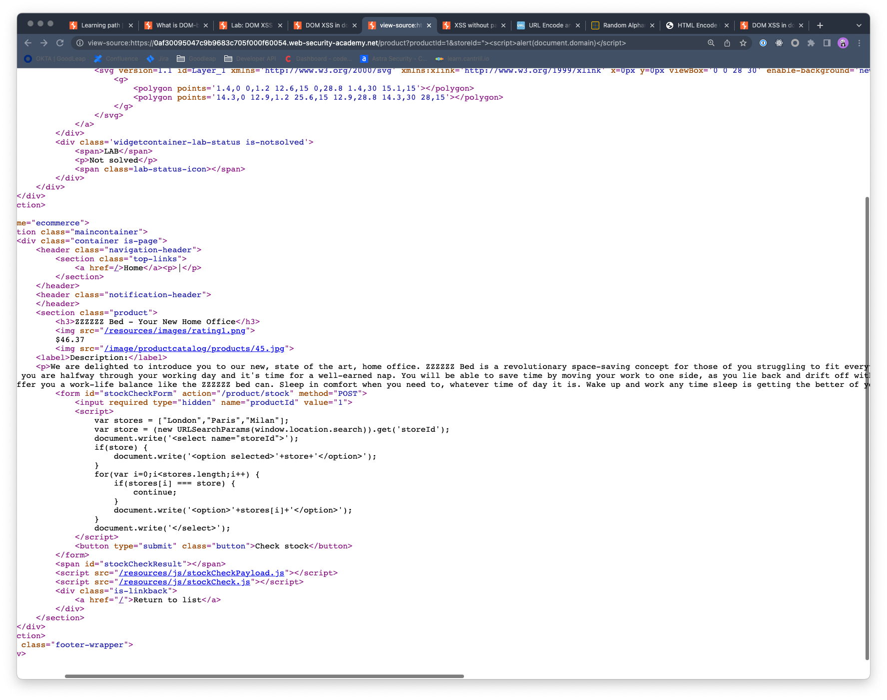

## DOM XSS in document.write sink using source location.search inside a select element

### Objective:
- This lab contains a DOM-based cross-site scripting vulnerability in the stock checker functionality. 
- It uses the JavaScript `document.write` function, which writes data out to the page. 
- The `document.write` function is called with data from `location.search` which you can control using the website URL. 
- The data is enclosed within a select element.
- To solve this lab, perform a cross-site scripting attack that breaks out of the select element and calls the `alert` function.

### Security Weakness:
- Click on **`View Details`** for any product on the page. 
- Inspecting the url we observe there is a **`productId=<id>`** parameter
	Example: https://LAB-ID.web-security-academy.net/product?productId=3 
- If we view the source of the page, we notice there is a script tag with the following code:

- Notice that it is trying to fetch **`storeId`** from the url parameters by calling **`window.location.search`**. 
- However, we don't find any in our url. But it is something we can control.
- Let's try to break the **`select`** tag inside **`document.write()`** and introduce our xss payload.
- We can use the following payload to exploit: **`">`** and our complete url will look like:
**`https://LAB-ID.web-security-academy.net/product?productId=1&storeId=">`**

### Exploitation Methodology:

### Insecure Code:

### Secure Code:
