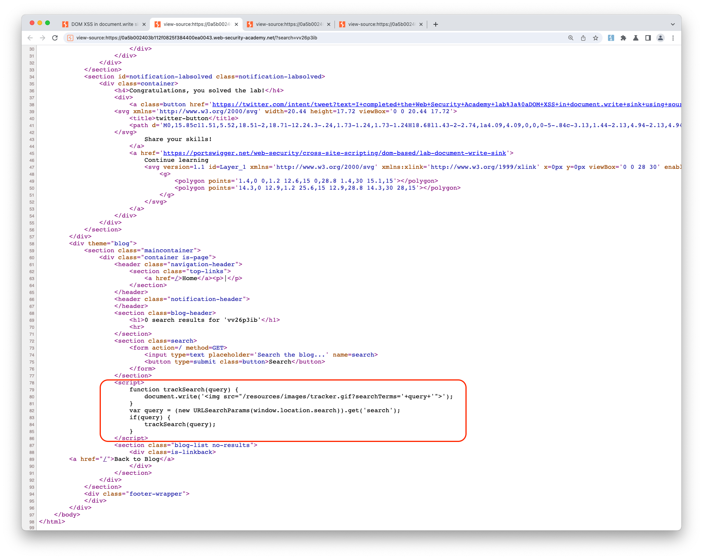

## DOM XSS in document.write sink using source location.search

### Objective:
- This lab contains a DOM-based cross-site scripting vulnerability in the search query tracking functionality. 
- It uses the JavaScript `document.write` function, which writes data out to the page. 
- The `document.write` function is called with data from `location.search`, which you can control using the website URL.
- To solve this lab, perform a cross-site scripting attack that calls the `alert` function.

### Security Weakness:

### Exploitation Methodology:
- We start with identifying the sink where our source is being passed. 
- From our lab objective we already know that the search field is vulnerable to DOM based XSS
- When we send a random alphanumeric value in the search field and view the page source we see that our data is being fetched using **`window.location.search`** 
- Our source is then passed on to **`tracksearch`** function where it is passed inside **`document.write()`**
- We know that **`document.write()`** would execute script tags.

- We need to terminate the string before appending our xss payload. We can terminate the string and the tag by appending **`'">`** to our payload, **``**
- Our final payload will look like: **`'">`**

### Insecure Code:

### Secure Code:
