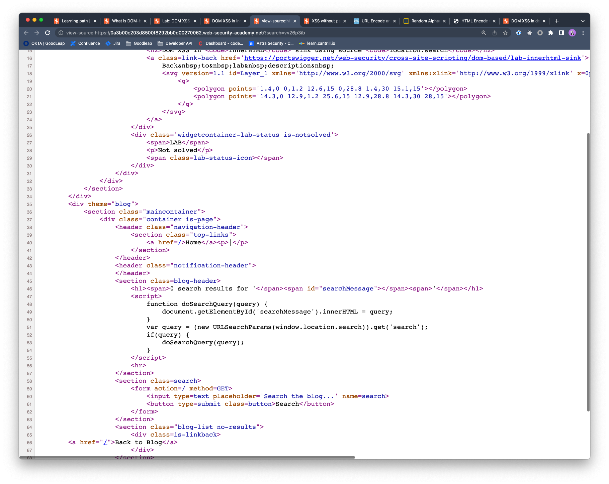
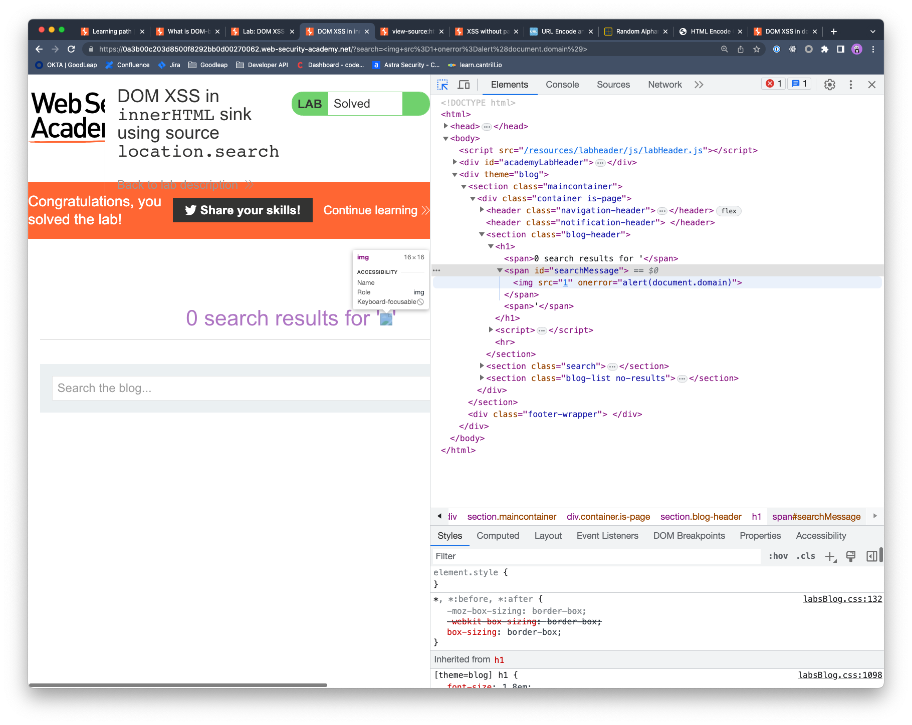

## DOM XSS in innerHTML sink using source location.search

### Objective:
- This lab contains a DOM-based cross-site scripting vulnerability in the search blog functionality. 
- It uses an `innerHTML` assignment, which changes the HTML contents of a `div` element, using data from `location.search`.
- To solve this lab, perform a cross-site scripting attack that calls the `alert` function.

### Security Weakness:

### Exploitation Methodology:
- Let's start with sending a random alphanumeric value to the search field and identify our context
- We notice our value is reflected on **`search results for 'OUR-VALUE' `**
- Upon reviewing the page source we notice there is a JavaScript code within in the **`script`** tag that get's our search string by calling **`window.location.search`**

- We know that **`innerHTML`** doesn't accept **`script`** elements. We can use **`img`** tag as an alternative to execute our payload. 
- We can simply type this payload in our search input field and exploit the DOM XSS: **``**
- We can also view our xss payload by inspecting the page.

### Insecure Code:

### Secure Code:
