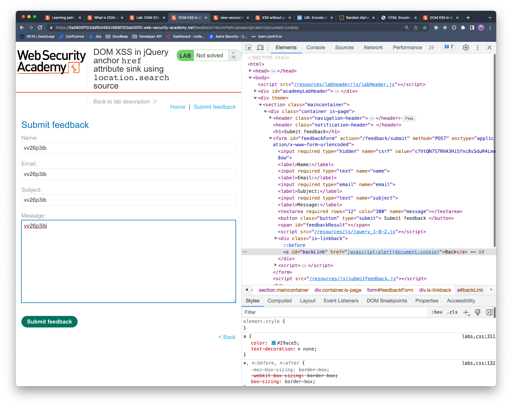

## DOM XSS in jQuery anchor href attribute sink using location.search source

### Objective:
- This lab contains a DOM-based cross-site scripting vulnerability in the submit feedback page. 
- It uses the jQuery library's `$` selector function to find an anchor element, and changes its `href` attribute using data from `location.search`.
- To solve this lab, make the "back" link alert `document.cookie`.

### Security Weakness:

### Exploitation Methodology:
- We start with identifying the xss context by passing an alphanumeric value to the **`returnPath`** parameter within the url.
- We see that it is reflected within the href attribute for the back link button. 
- If we view the page source, we find there is a script tag that is pulling the **`returnPath`** value and assigning it to the href attribute using jQuery. 
```html
<script>
	$(function() {
		$('#backLink').attr("href", (new URLSearchParams(window.location.search)).get('returnPath'));
	});
</script>
```
- We can essentially inject javascript code to our **`returnPath`** which would get executed when the back button is clicked.
- We can also inspect the page and view the source to make sure that the **`href`** attribute is updated with our JavaScript.


### Insecure Code:

### Secure Code:
