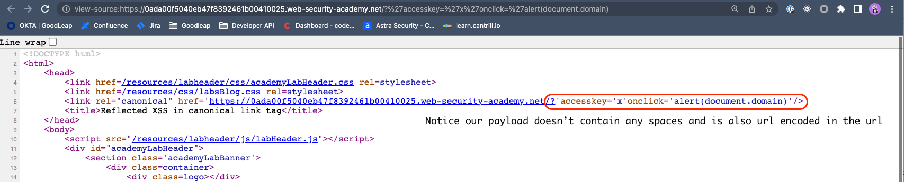

## Reflect XSS in canonical link tag

### Objective:
- This lab reflects user input in a canonical link tag and escapes angle brackets.
- To solve the lab, perform a cross-site scripting attack on the home page that injects an attribute that calls the `alert` function.
- To assist with your exploit, you can assume that the simulated user will press the following key combinations:
	- **`ALT+SHIFT+X`**
	- **`CTRL+ALT+X`**
	- **`Alt+X`**

Please note that the intended solution to this lab is only possible in Chrome.

### Security Weakness:

### Exploitation Methodology:
- What is a **Canonical** tag ?
	- A canonical tag, is an html element used to indicate the prefered version of a webpage when multiple version with similar content exist. 
	- They are placed in the head section of an html document and use the **`rel=canonical`** attribute.
	- Their primary purpose is to inform search engines about the preferred version of a webpage among duplicates
- Notice that for our web application we can inject attributes to the link tag that is using canonical attribute
- To test for this simply add the following: **`/?search=test`** and when we view the page source we should be able to view that same added to our url in link href of the canonical attribute.

- Now, we can introduce an attribute called **`accesskey='x'`** and when if we can persuade the victim user into pressing **ALT+SHIFT+X(Windows)** or **CTRL+ALT+X(OS X)** we can trigger JavaScript by calling the **onclick** event to execute javascript.
- Let's use the following payload to complete this lab:
```html
https://YOUR-LAB-ID.web-security-academy.net/?%27accesskey=%27x%27onclick=%27alert(1)
```
- If we url decode our payload it will be **`'accesskey='x'onclick='alert(1)`**. 

> 🗒️ **NOTE**
> To solve the lab we need to make sure there are no spaces in our payload and it's url encoded.



### Insecure Code:

### Secure Code:
