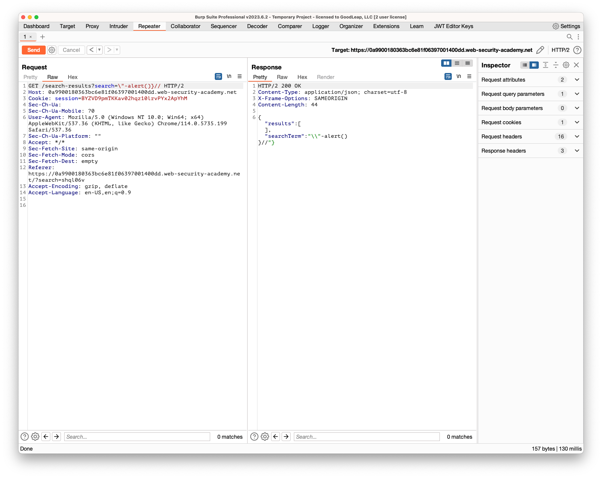

## Reflected DOM XSS

### Objective:
- This lab demonstrates a reflected DOM vulnerability. 
- Reflected DOM vulnerabilities occur when the server-side application processes data from a request and echoes the data in the response. 
- A script on the page then processes the reflected data in an unsafe way, ultimately writing it to a dangerous sink.
- To solve this lab, create an injection that calls the `alert()` function.

### Security Weakness:

### Exploitation Methodology:
- Inject a alphanumeric value into the search field to identify our xss context. 
- View the page source and we observe that there are two script tags 
	- One sets the source to **/resources/js/searchResults.js**
	- Second calls the **search** function with **search-results** parameter
- If we read the code for **search(path)** function takes the parameter ('search-results' in our case) and also fetches our searchTerm by making a call to **window.location.search**

- From our burp logger we can confirm that the server makes a request to **/search-results?search=searchTerm** which returns a json response which also includes our searchTerm.

- Notice that if we inject a backslash the site isn't escaping them, when the JSON response attempts to escape the opening double-quotes character, it adds a second backslash. The resulting double-backslash causes the escaping to be effectively canceled out. This means that the double-quotes are processed unescaped, which closes the string that should contain the search term.

- An arithmetic operator (in this case the subtraction operator) is then used to separate the expressions before the `alert()` function is called. 
	- Our payload will now be: **\"-alert()}//** 
- Finally, a closing curly bracket and two forward slashes close the JSON object early and comment out what would have been the rest of the object. As a result, the response is generated as follows:

### Insecure Code:

### Secure Code:
