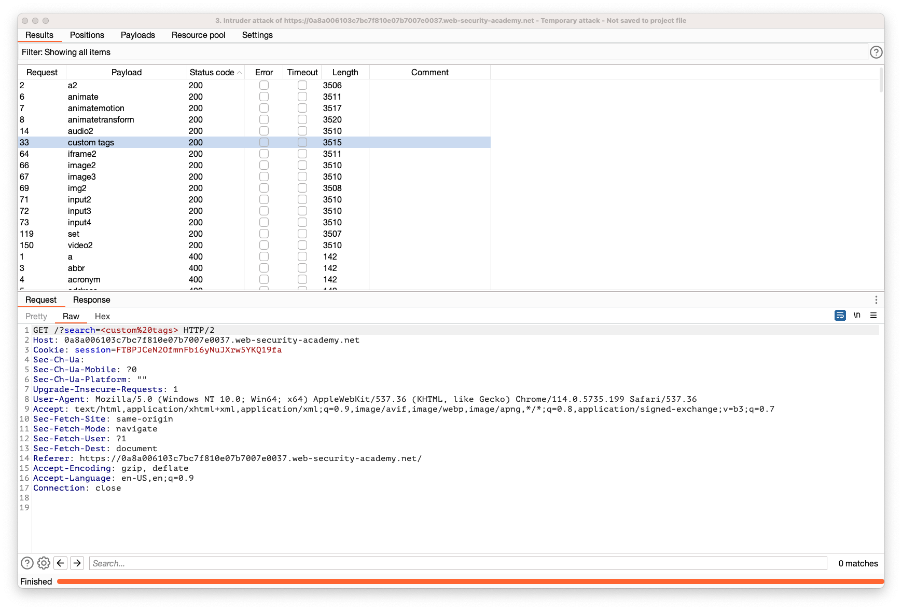

## Reflected XSS into HTML context with all tags blocked except custom ones

### Objective:
- This lab blocks all HTML tags except custom ones.
- To solve the lab, perform a cross-site scripting attack that injects a custom tag and automatically alerts `document.cookie`.

### Security Weakness:

### Exploitation Methodology:
1. Search field on the web application is vulnerable to xss attack
2. When we place a html tag, the server returns the following response: **Tag is not allowed**.
3. Using burp send the request to intruder and get a list of all tags from xss cheatsheet to find out if the server allows any tags.

> 🗒️ **NOTE**
> Although, the server allows different tags based on our intruder results, from our objective it is clearly mentioned that to solve the lab we need to use custom tag. Also, note that our exploit payload should **automatically** alert `document.cookie`.
4. Go to the exploit server and paste the following code, replacing `YOUR-LAB-ID` with your lab ID:
```html
<script> 
location = 'https://YOUR-LAB-ID.web-security-academy.net/?search=%3Cxss+id%3Dx+onfocus%3Dalert%28document.cookie%29%20tabindex=1%3E#x'; 
</script>
```
5. Click "Store" and "Deliver exploit to victim". 
6. Payload explaination: **`<xss id=x onfocus=alert(document.cookie) tabindex=1>#x`**
	1. We are using a custom tag named **`xss`** 
	2. An **`id`** with a value set to **`x`** is defined 
	3. **`tabindex=1`** value will make the browser to focus on this tag element  on hitting the tab for the first time.
	4. The trailing **`#x`** will focus on the element automatically when the html is rendered.
7. The purpose of **`location`** inside the script tag is to redirect to the specified url.
8. This injection creates a custom tag with the ID `x`, which contains an `onfocus` event handler that triggers the `alert` function. The hash at the end of the URL focuses on this element as soon as the page is loaded, causing the `alert` payload to be called.

### Insecure Code:

### Secure Code:
