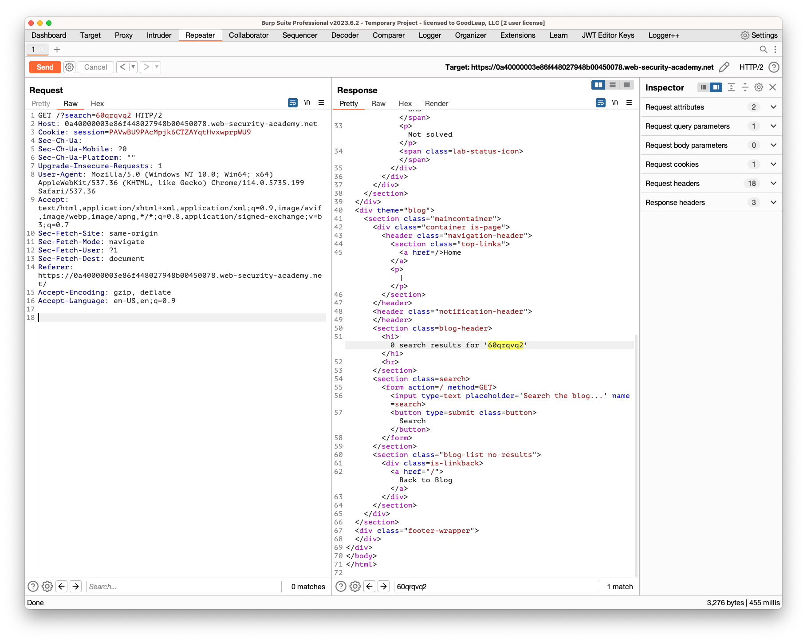
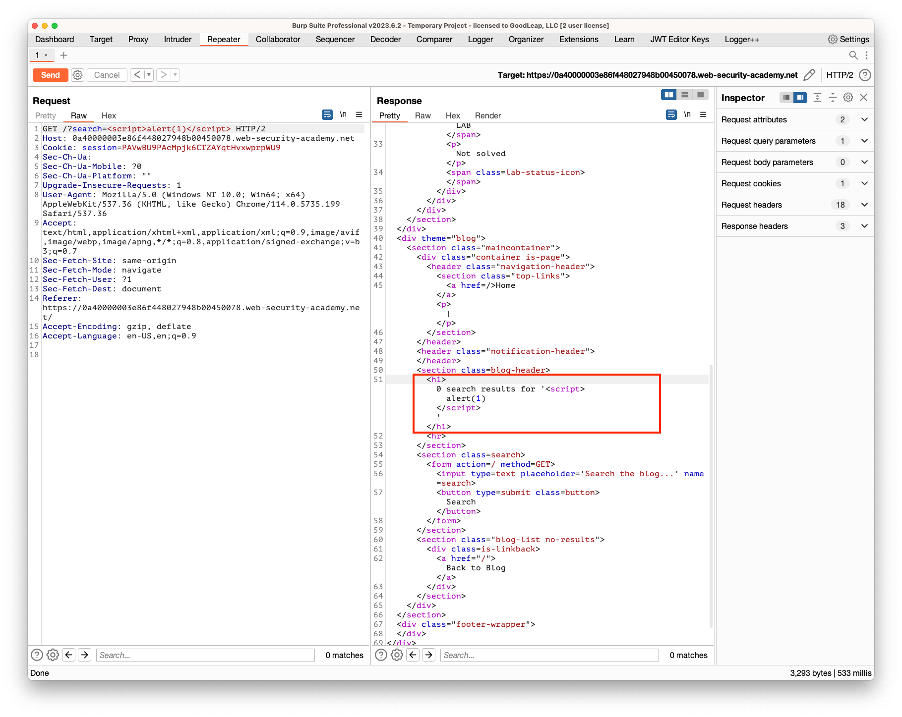

## Reflected XSS into HTML context with nothing encoded

### Objective:
To solve the lab, perform a cross-site scripting attack that calls the `alert` function.

### Security Weakness:
This lab contains a simple **reflected cross-site scripting** vulnerability in the search functionality.

### Exploitation Methodology:
1. Search feild on the web page is vulnerable to reflected XSS
2. Enter a random alpha numberic value in the search parameter and identify the context of your xss value

3. We see the the value is reflected between **h1** tags
4. Introduce a new html tag that can execute javascript on the victims browser.  
5. To execute javascript, copy and paste the following javascript code in the search input and click "search" to solve the lab.
```javascript
<script>alert(1)</script>
```
6. Now, we see our script tag between h1 tags


### Insecure Code:

### Secure Code:
