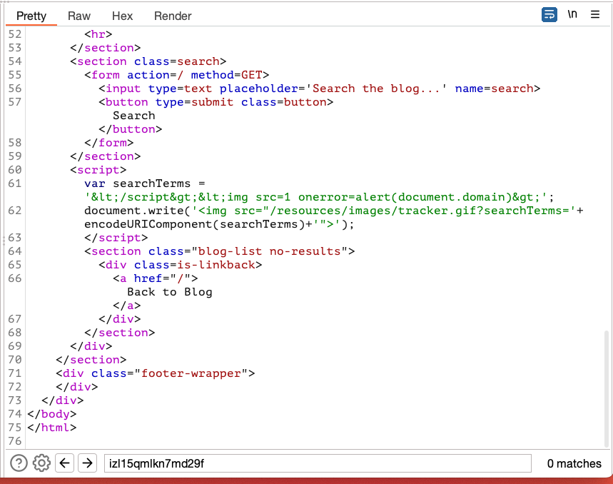
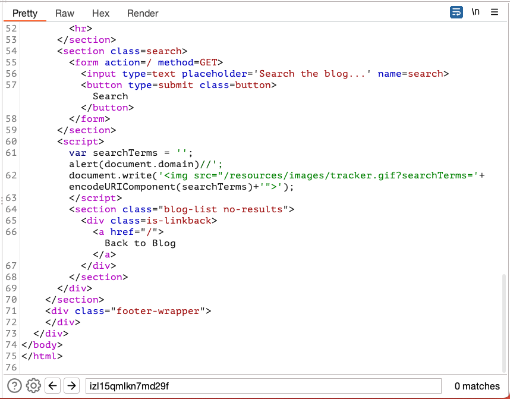

## Reflected XSS into Javascript with angle brackets HTML encoded

### Objective:
- This lab contains a reflected cross-site scripting vulnerability in the search query tracking functionality where angle brackets are encoded. 
- The reflection occurs inside a JavaScript string. 
- To solve this lab, perform a cross-site scripting attack that breaks out of the JavaScript string and calls the `alert` function.

### Security Weakness:

### Exploitation Methodology:
- From the lab objective we already know that search field is vulnerable to xss
- Let's send a unique alphanumeric value to identify our xss context
- We can see that it's inside a script tag assigned to a variable

- When we send our payload to end script tags the application encodes angle brackets as shown below.

- We can end our string and inject javascript by using the payload **`';alert(document.domain)//`**

### Insecure Code:

### Secure Code:
