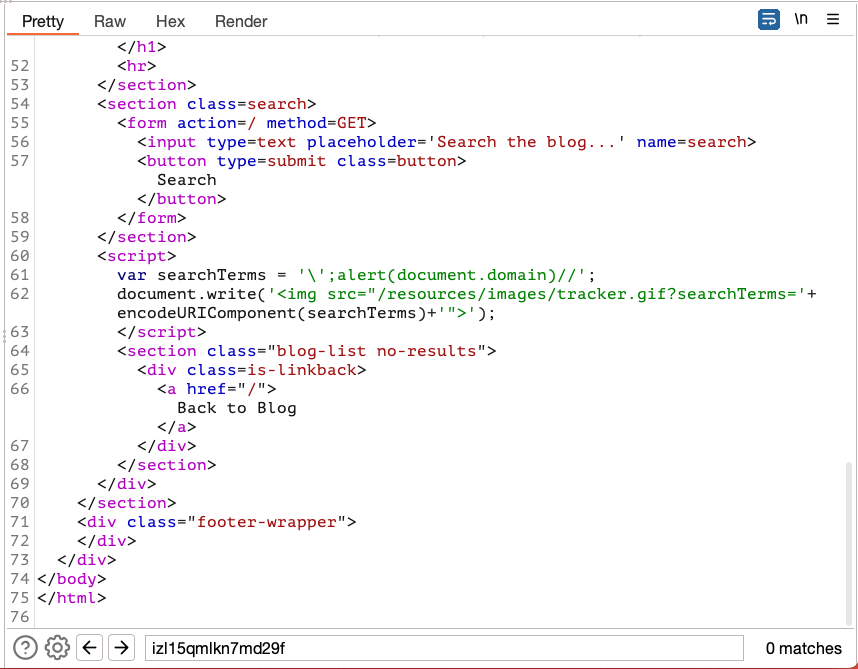
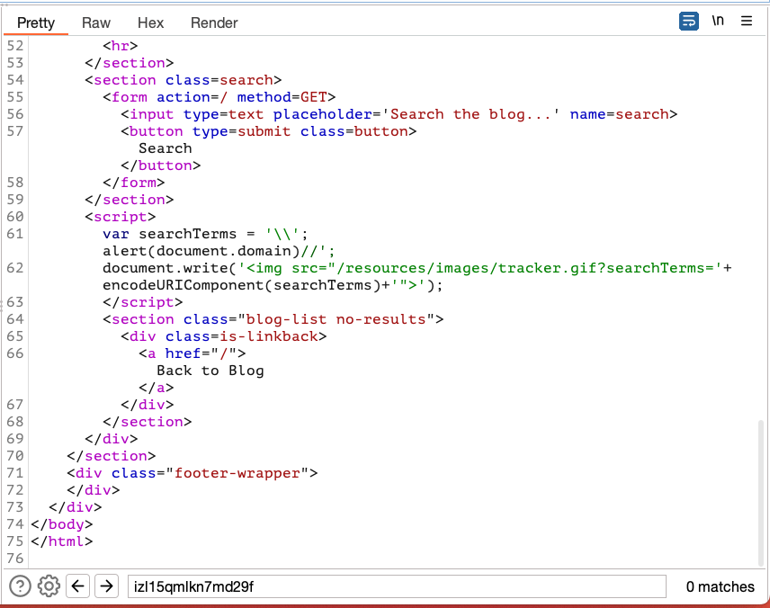

## Reflected XSS into a JavaScript string with angle brackets and double quotes HTML-encoded and single quotes escaped

### Objective:
- This lab contains a reflected cross-site scripting vulnerability in the search query tracking functionality where angle brackets are HTML encoded and single quotes are escaped.
- To solve this lab, perform a cross-site scripting attack that breaks out of the JavaScript string and calls the `alert` function.

### Security Weakness:

### Exploitation Methodology:
- Our unique alphanumeric payload gets reflected in script tag assigned to a variable called **`searchTerms`**
- If we try our payload `</script>` to break the script tag, we notice that angle brackets are encoded. 
- When we try to break out of JavaScript string, we notice that our string is being escaped by the application. 

- To bypass this we will try to introduce a backslash infront of payload to escape the server side validation to escape quotes.

### Insecure Code:

### Secure Code:
