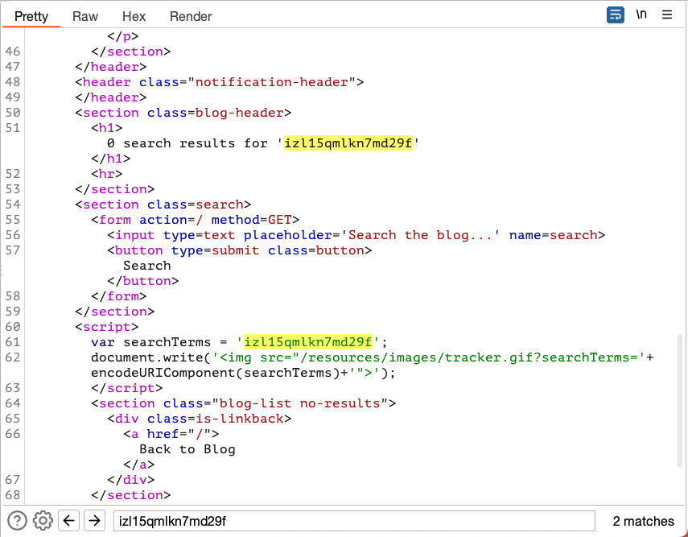
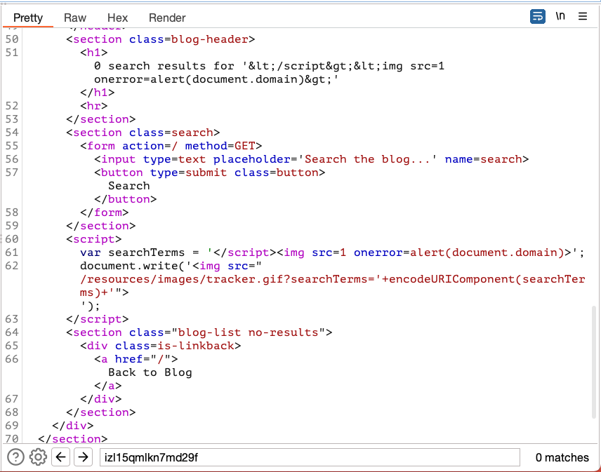

## Reflected XSS into a javascript string with single quote and backslash escaped

### Objective:
- This lab contains a reflected cross-site scripting vulnerability in the search query tracking functionality. 
- The reflection occurs inside a JavaScript string with single quotes and backslashes escaped.
- To solve this lab, perform a cross-site scripting attack that breaks out of the JavaScript string and calls the `alert` function.

### Security Weakness:

### Exploitation Methodology:
- From our lab objective we already know that search input field is vulnerable to xss attacks
- Let's try to enter a random alpha numeric value in search and try to find our xss context

- We see that our input is inside a script tag assigned to a variable. 
- To exploit this lab, we need to end the script tag and introduce our own tag to execute JavaScript payload. 

- To understand how this payload works [click here](./XSS%20Contexts.md#terminating-the-existing-script) 

### Insecure Code:

### Secure Code:
