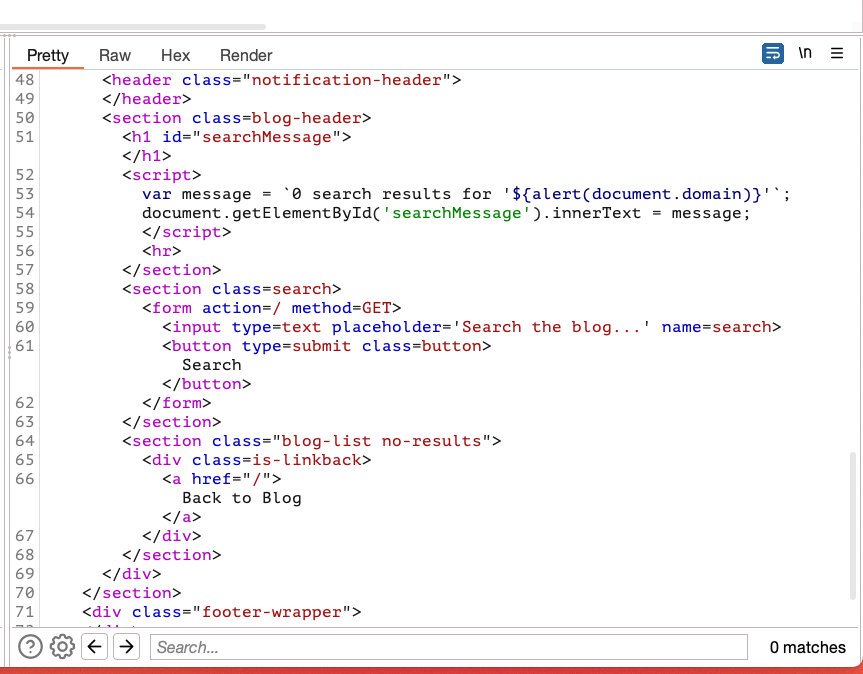

## Reflected XSS into a template literal with angle brackets, single, double quotes, backslash and backticks unicode-escaped

### Objective:
- This lab contains a reflected cross-site scripting vulnerability in the search blog functionality. 
- The reflection occurs inside a template string with angle brackets, single, and double quotes HTML encoded, and backticks escaped.
- To solve this lab, perform a cross-site scripting attack that calls the `alert` function inside the template string.

### Security Weakness:

### Exploitation Methodology:
- We start with identifying the xss context for our input and notice that the server is using backticks (template literals) to evaluate the expression. 
- We can simply pass the payload **`${alert(document.domain)}`** to execute our JavaScript.

### Insecure Code:

### Secure Code: