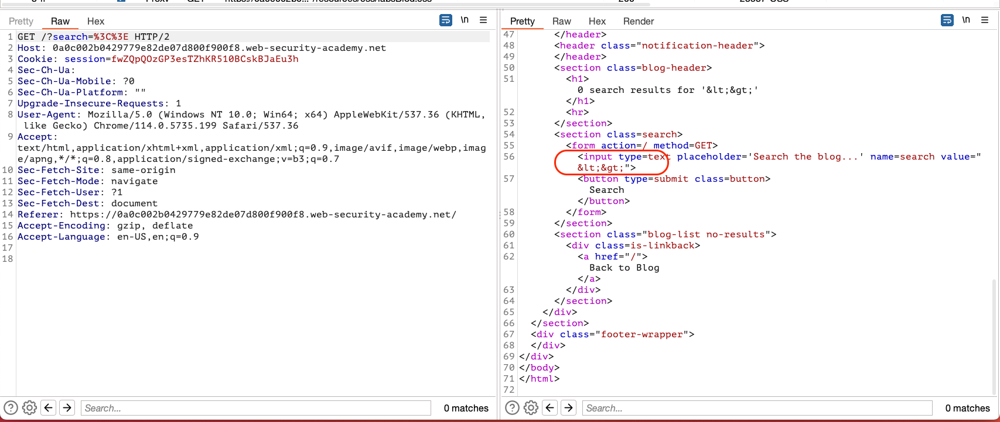

## Reflected XSS into attribute with angle brackets HTML-encodedTitle

### Objective:
- This lab contains a reflected cross-site scripting vulnerability in the search blog functionality where angle brackets are HTML-encoded. 
- To solve this lab, perform a cross-site scripting attack that injects an attribute and calls the `alert` function.

### Security Weakness:

### Exploitation Methodology:
- From our lab objective we already know that the search input field is vulnerable to xss
- Web application html encodes angle brackets

- But we can break out the **value** element and add JavaScript to the html **input** element.
- Use the payload to autofocus on the input element and execute JavaScript onfocus. Finally, add **`x="`** to gracefully repair the markup
```javascript
" autofocus onfocus=alert(document.domain) x="
```

### How does the payload work ?
- How is the **`x="`** gracefully repairing the markup
	- So, basically there is a **`"`** added at the end of our input string value
	- To make sure the markup isn't broken because of this we add the **`x="`**

### Insecure Code:

### Secure Code:
