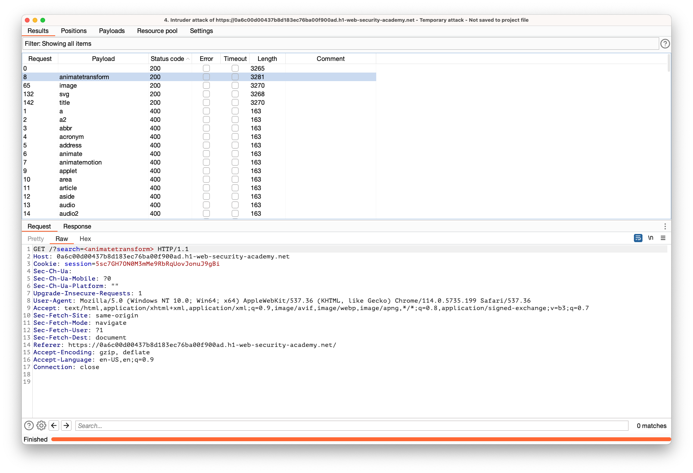

## Reflected XSS with some SVG markup allowed

### Objective:
- This lab has a simple reflected XSS vulnerability. The site is blocking common tags but misses some SVG tags and events.
- To solve the lab, perform a cross-site scripting attack that calls the `alert()` function.

### Security Weakness:

### Exploitation Methodology:
- Search input field on the web application is vulnerable to xss
- But it does block most of the html tags. Let's use intruder to find if there are any tags that are being allowed. 

- We see there are four tags that are being allowed by the application
	- **animatetransform, image, svg, title**
- Based on the payloads available from our xss cheatsheet we can verify and solve this lab using 
```html
<svg><animatetransform onbegin=alert(1) attributeName=transform>
```

### Insecure Code:

### Secure Code:
