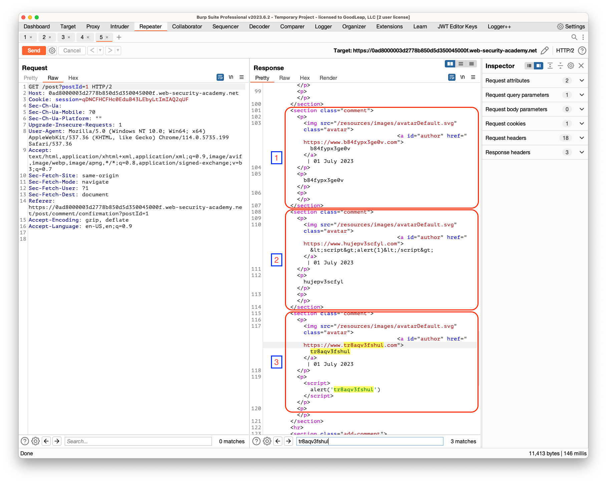
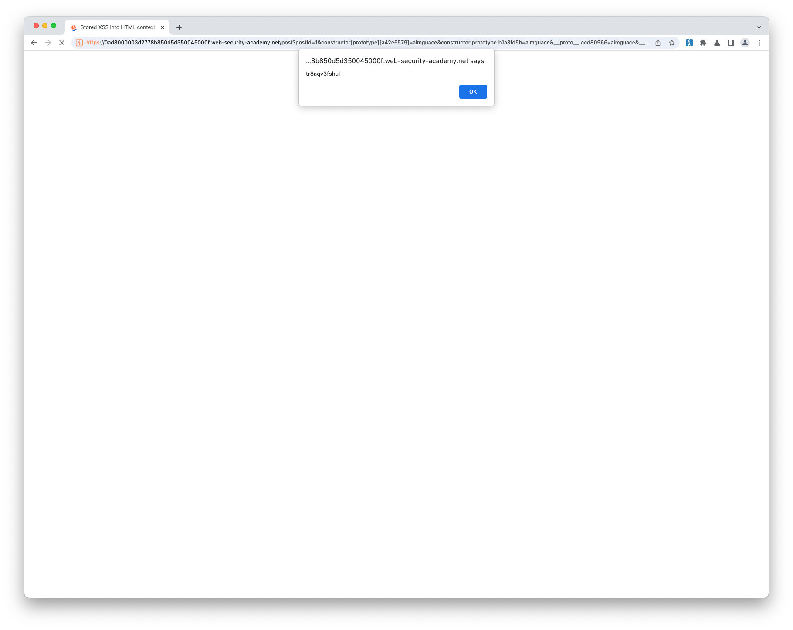

## Stored XSS into HTML context with nothing encoded

### Objective:
- This lab contains a **stored cross-site scripting** vulnerability in the comment functionality.
- To solve this lab, submit a comment that calls the `alert` function when the blog post is viewed.

### Security Weakness:

### Exploitation Methodology:
1. Identify the xss context by entering a random alpha numeric value in all inputs as shown in box-1.
2. Based on the reflected response **Name** and **Comment** seems to be vulnerable to xss
3. To exploit use the following xss payload 
    ```html
    <script>alert(1)</script>
	```
4. As shown in box-2, our name value is encoded. So, it's not vulnerable to xss. 
5. Entering an xss payload value in the comment results in a successful xss. Shown in box-3




### Insecure Code:

### Secure Code:
