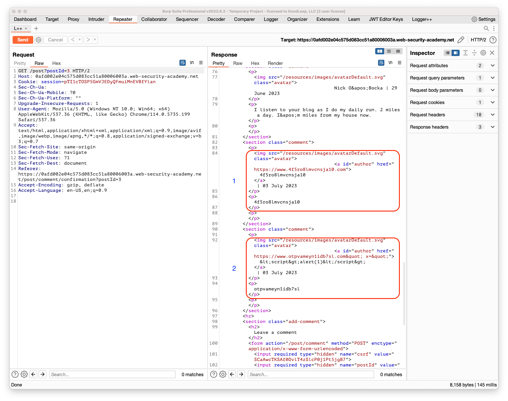

## Stored XSS into anchor href attribute with double quotes HTML-encoded

### Objective:
- This lab contains a stored cross-site scripting vulnerability in the comment functionality. 
- To solve this lab, submit a comment that calls the `alert` function when the comment author name is clicked.

### Security Weakness:

### Exploitation Methodology:
- By filling out the comments information and seeing where our input is being reflected we notice that our website information is directly reflected in the **`href`** 
- We also notice that the name field is also reflected. 
- Upon sending a simple script tag with alert function call for name input and trying to break out of the href we see that our angle brackets and double quotes are html encoded 

> 🗒️ **NOTE**
> 
> Sometimes the XSS context is into a type of HTML tag attribute that itself can create a scriptable context. Here, you can execute JavaScript without needing to terminate the attribute value. For example, if the XSS context is into the `href` attribute of an anchor tag, you can use the `javascript` pseudo-protocol to execute script. For example: `<a href="javascript:alert(document.domain)">`

- As mentioned in the note we can use the payload **`javascript:alert(document.domain)`** to solve our lab.

### Insecure Code:

### Secure Code:
