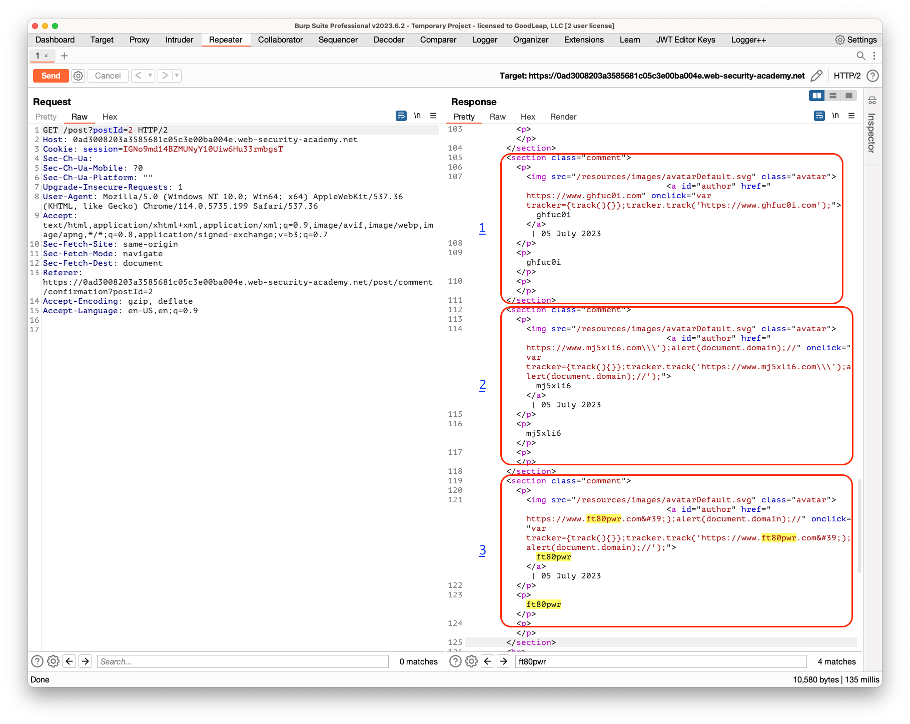

## Stored XSS into onclick event with angle brackets and double quotes HTML-encoded and single quotes and backslash escaped

### Objective:
- This lab contains a stored cross-site scripting vulnerability in the comment functionality.
- To solve this lab, submit a comment that calls the `alert` function when the comment author name is clicked.

### Security Weakness:

### Exploitation Methodology:
- We start with identifying the XSS context within comment functionality. As shown in box-1 we see that our xss context is within **`onclick`** event handler.
- Trying to break out of JavaScript string we see that our backslashes are escaped by the server. Shown in box-2 (attempt 2)
- Now, we try to html encode our string value to let our JavaScript execute (shown in box-3).
- More information on how this exploit works can be found [here](XSS%20Contexts#making-use-of-html-encoding)

### Insecure Code:

### Secure Code:
