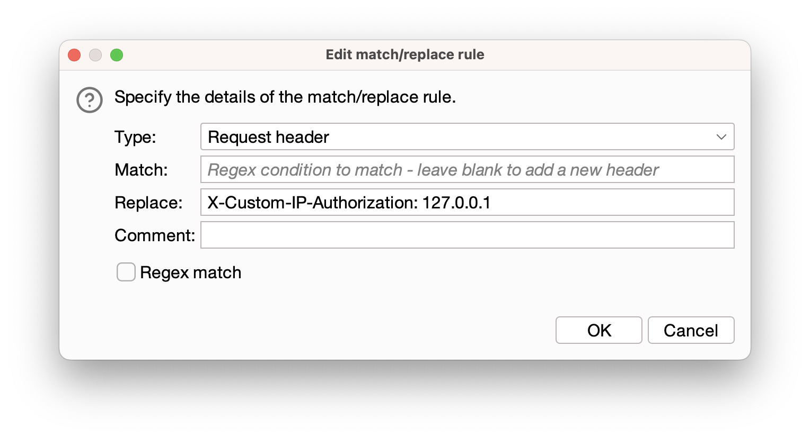
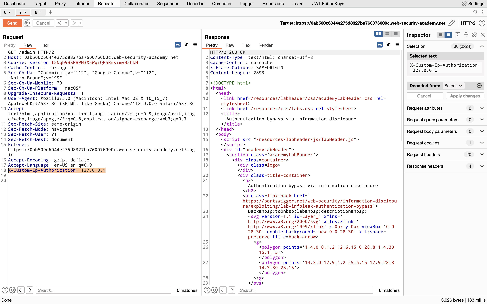

## Authentication bypass via Information Disclosure

### Objective:
This lab's administration interface has an authentication bypass vulnerability, but it is impractical to exploit without knowledge of a custom HTTP header used by the front-end.
To solve the lab, obtain the header name then use it to bypass the lab's authentication. Access the admin interface and delete Carlos's account.

### Security Weakness:

### Exploitation Methodology:
1.  In Burp Repeater, browse to `GET /admin`. The response discloses that the admin panel is only accessible if logged in as an administrator, or if requested from a local IP.
2.  Send the request again, but this time use the `TRACE` method: `TRACE /admin`
3.  Study the response. Notice that the `X-Custom-IP-Authorization` header, containing your IP address, was automatically appended to your request. This is used to determine whether or not the request came from the `localhost` IP address.
4.  Go to "Proxy" > "Proxy Settings", scroll down to the "Match and Replace" section, and click "Add". Leave the match condition blank, but in the "Replace" field, enter:
    *X-Custom-IP-Authorization: 127.0.0.1*
    
    **Burp Proxy will now add this header to every request you send.**
    
    
5.  Browse to the home page. Notice that you now have access to the admin panel, where you can delete Carlos.
### Insecure Code:

### Secure Code:
