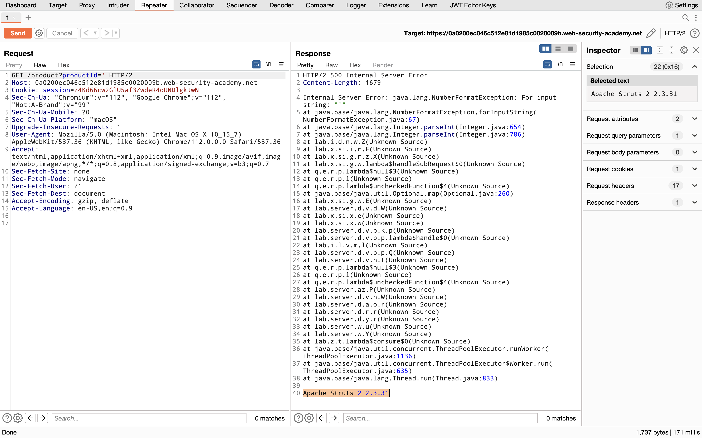

## Information Disclosure in error messages

### Objective:
This lab's verbose error messages reveal that it is using a vulnerable version of a third-party framework. To solve the lab, obtain and submit the version number of this framework.

### Security Weakness:

### Exploitation Methodology:
1.  With Burp running, open one of the product pages.
2.  In Burp, go to "Proxy" > "HTTP history" and notice that the `GET` request for product pages contains a `productID` parameter. Send the `GET /product?productId=1` request to Burp Repeater. Note that your `productId` might be different depending on which product page you loaded.
3.  In Burp Repeater, change the value of the `productId` parameter to a non-integer data type, such as a string or a single quote. Send the request:
    `GET /product?productId='`
    
4.  The unexpected data type causes an exception, and a full stack trace is displayed in the response. This reveals that the lab is using Apache Struts 2 2.3.31.
5.  Go back to the lab, click "Submit solution", and enter **2 2.3.31** to solve the lab.

### Insecure Code:
This is a bad coding practice because it does not perform any validation or error handling for the `id` parameter. It blindly passes the `id` to the `getLoanById()` function, which may result in an error if the `id` is invalid or does not exist in the database. This could lead to security vulnerabilities and expose sensitive information about the system if an attacker deliberately passes an invalid `id`.
Addtionally, notice that the bad example is also logging the loanObject which could contain PII information.
```javascript
const { v4: uuidv4 } = require('uuid');

app.get('/loans/:id', (req, res) => {
  try {
    const loan = getLoanById(req.params.id);
    res.send(loan);
  } catch (error) {
    console.error(`Error fetching loan ${req.params.id}: ${error.message}`);
    console.error(`Loan details: ${JSON.stringify(loan)}`);
    res.status(500).send('Internal Server Error');
  }
});
```

### Secure Code:
This is a good example because it first checks that the `id` parameter is a valid UUIDv4 before attempting to use it. If the `id` is not a valid UUIDv4, the client will receive a "400 Bad Request" response with an appropriate error message. If an error occurs while retrieving the loan object, the catch block will execute and send a "500 Internal Server Error" response. This provides better security and error handling compared to the bad example.
```javascript
const { v4: uuidv4 } = require('uuid');

app.get('/loans/:id', (req, res) => {
  const loanId = req.params.id;
  if (!uuidv4.validate(loanId)) {
    res.status(400).send('Invalid loan ID format');
    return;
  }
  try {
    const loan = getLoanById(loanId);
    res.send(loan);
  } catch (error) {
    console.error(`Error fetching loan ${loanId}: ${error.message}`);
    res.status(500).send('Internal Server Error');
  }
});

```
