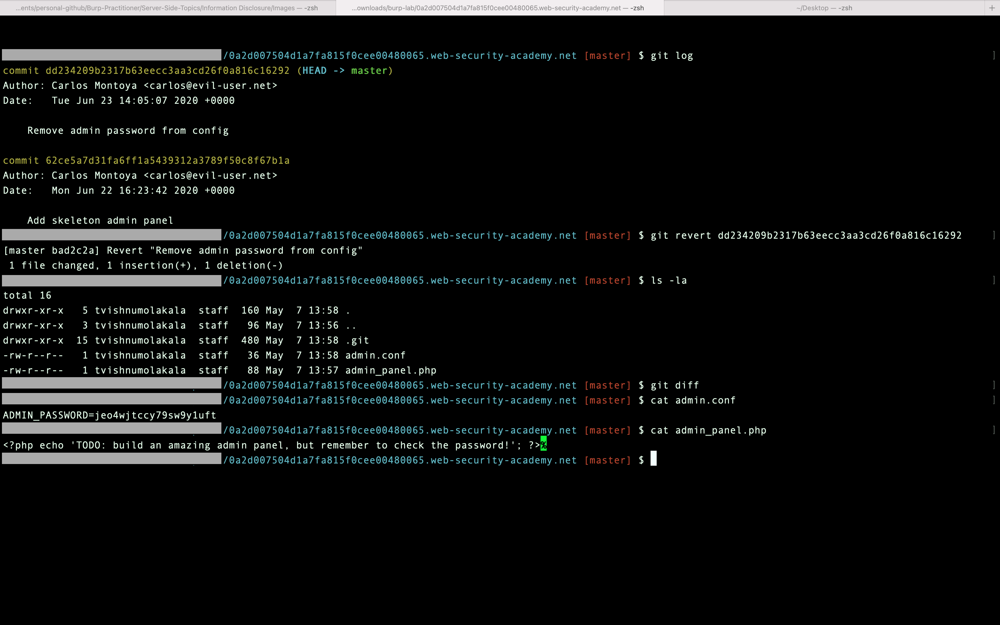

## Information Disclosure in version control history

### Objective:
This lab discloses sensitive information via its version control history. To solve the lab, obtain the password for the `administrator` user then log in and delete Carlos's account.

### Security Weakness:

### Exploitation Methodology:
1.  Open the lab and browse to `/.git` to reveal the lab's Git version control data.
2.  Download a copy of this entire directory. For Linux users, the easiest way to do this is using the command:
    `wget -r https://YOUR-LAB-ID.web-security-academy.net/.git/`
3.  Explore the downloaded directory using your local Git installation. Notice that there is a commit with the message `"Remove admin password from config"`.
4.  Look closer at the diff for the changed `admin.conf` file. Notice that the commit replaced the hard-coded admin password with an environment variable `ADMIN_PASSWORD` instead. However, the hard-coded password is still clearly visible in the diff.

5.  Go back to the lab and log in to the administrator account using the leaked password.
6.  To solve the lab, open the admin interface and delete Carlos's account.

### Insecure Code:

### Secure Code:
