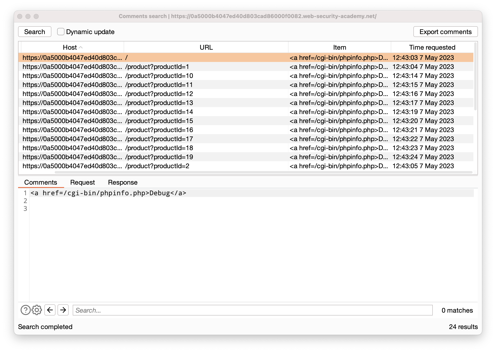
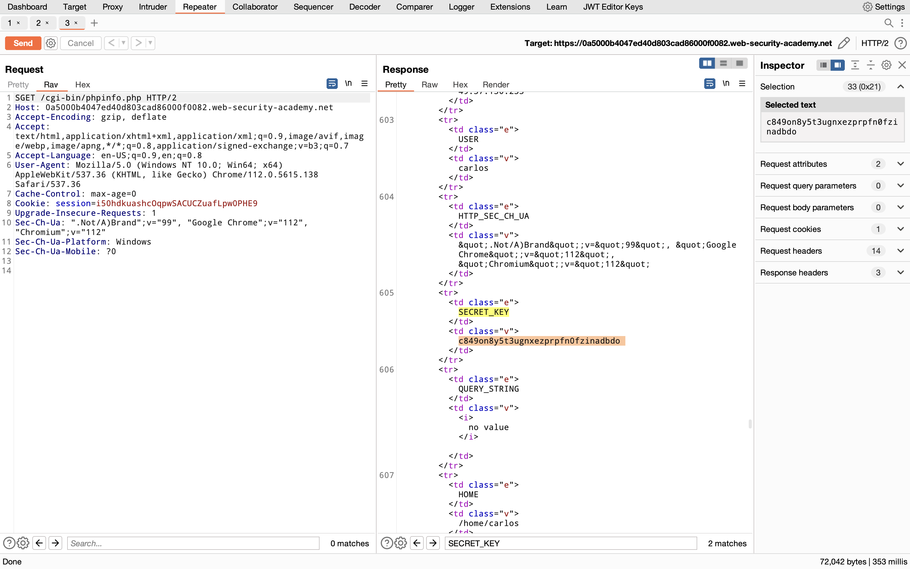

## Information Disclosure on debug page

### Objective:
This lab contains a debug page that discloses sensitive information about the application. To solve the lab, obtain and submit the `SECRET_KEY` environment variable.

### Security Weakness:
Developer adds the path to debug page in comments which contains the secret key information.

### Exploitation Methodology:
1.  With Burp running, browse to the home page.
2.  Go to the "Target" > "Site Map" tab. Right-click on the top-level entry for the lab and select **"Engagement tools" > "Find comments"**. Notice that the home page contains an HTML comment that contains a link called "Debug". This points to `/cgi-bin/phpinfo.php`.

1.  In the site map, right-click on the entry for `/cgi-bin/phpinfo.php` and select "Send to Repeater".

1.  In Burp Repeater, send the request to retrieve the file. Notice that it reveals various debugging information, including the `SECRET_KEY` environment variable.
2.  Go back to the lab, click "Submit solution", and enter the `SECRET_KEY` to solve the lab.

### Insecure Code:

### Secure Code:
